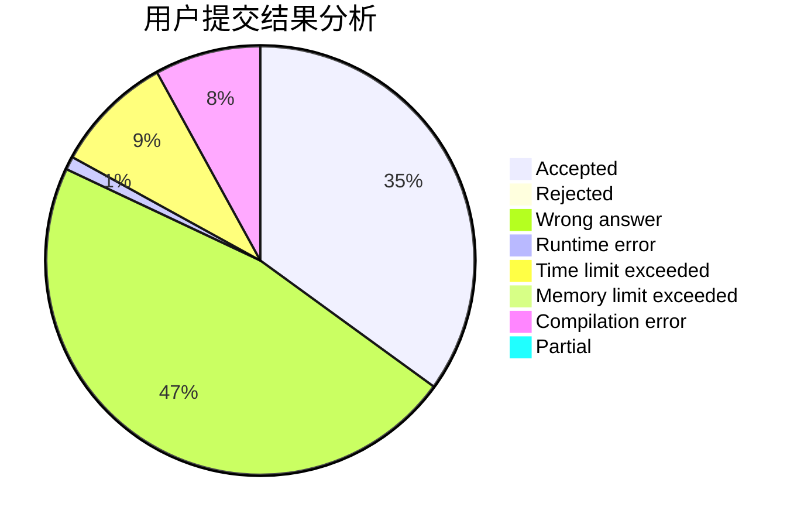
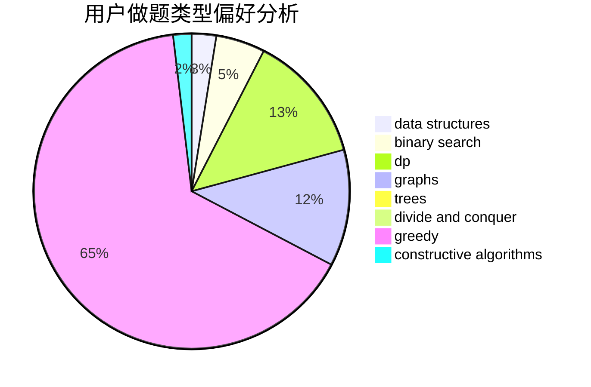

# hnust_liuzelin

<!-- tabs:start -->

#### **用户提交结果分析**

#### **用户做题类型偏好分析**

#### **用户错题知识点分析**

<!-- tabs:end -->
# 推荐题目
[417C](https://codeforces.com/contest/417/problem/C)		constructive algorithms,
                        graphs,
                        implementation		  
[335D](https://codeforces.com/contest/335/problem/D)		brute force,
                        dp		  
[878E](https://codeforces.com/contest/878/problem/E)		combinatorics,
                        dp		  
[225C](https://codeforces.com/contest/225/problem/C)		dp,
                        matrices		  
[1424G](https://codeforces.com/contest/1424/problem/G)		data structures,
                        sortings		  
[204E](https://codeforces.com/contest/204/problem/E)		data structures,
                        implementation,
                        string suffix structures,
                        two pointers		  
[1383B](https://codeforces.com/contest/1383/problem/B)		bitmasks,
                        constructive algorithms,
                        dp,
                        games,
                        greedy,
                        math		  
[763B](https://codeforces.com/contest/763/problem/B)		constructive algorithms,
                        geometry		  
[178F3](https://codeforces.com/contest/178F/problem/3)		nan		  
[107C](https://codeforces.com/contest/107/problem/C)		bitmasks,
                        dp		  
