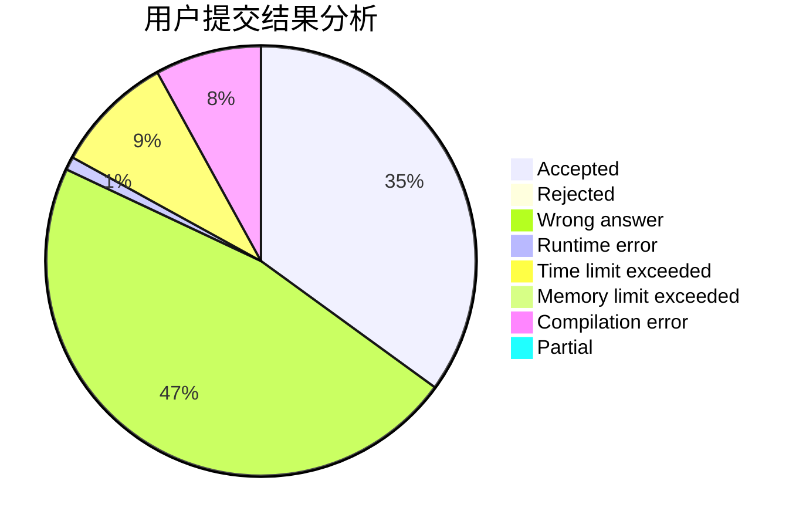
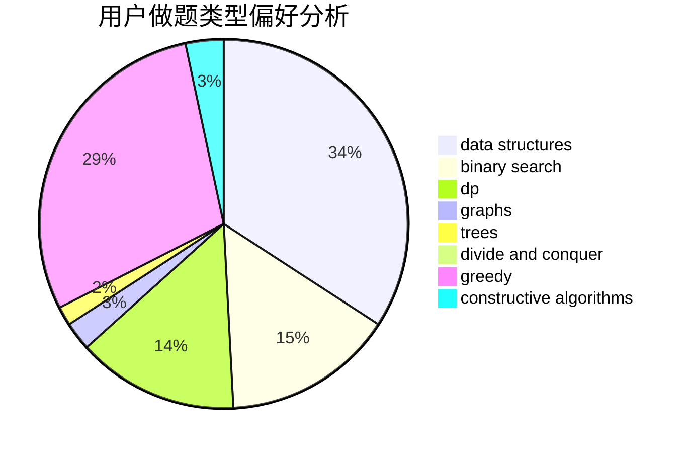

# hnust_liuzelin

<!-- tabs:start -->

#### **用户提交结果分析**

#### **用户做题类型偏好分析**

#### **用户错题知识点分析**

<!-- tabs:end -->
# 推荐题目
[442B](https://codeforces.com/contest/442/problem/B)		greedy,
                        math,
                        probabilities		  
[362C](https://codeforces.com/contest/362/problem/C)		data structures,
                        dp,
                        implementation,
                        math		  
[899D](https://codeforces.com/contest/899/problem/D)		constructive algorithms,
                        math		  
[243C](https://codeforces.com/contest/243/problem/C)		dfs and similar,
                        implementation		  
[1432F](https://codeforces.com/contest/1432/problem/F)		dsu,graphs,sortings,trees		  
[228E](https://codeforces.com/contest/228/problem/E)		2-sat,
                        dfs and similar,
                        dsu,
                        graphs		  
[13931](https://codeforces.com/contest/1393/problem/1)		dsu,graphs,sortings,trees		  
[781F](https://codeforces.com/contest/781/problem/F)		dsu,graphs,sortings,trees		  
[205A](https://codeforces.com/contest/205/problem/A)		brute force,
                        implementation		  
[1080B](https://codeforces.com/contest/1080/problem/B)		math		  
