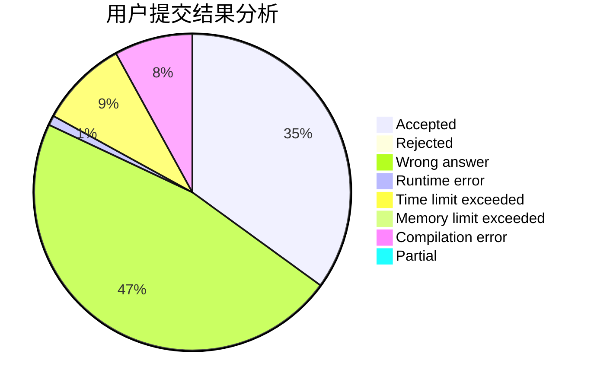
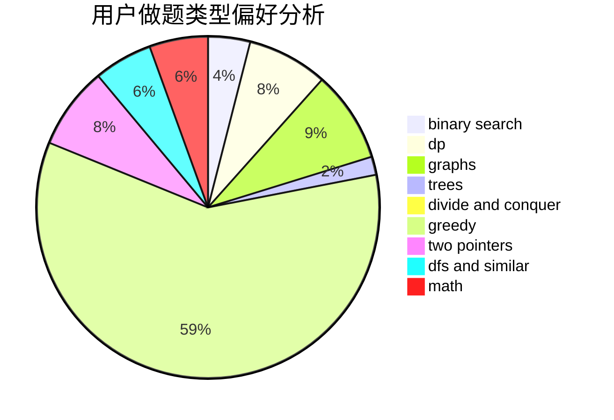

# hnust_liuzelin

<!-- tabs:start -->

#### **用户提交结果分析**

#### **用户做题类型偏好分析**

<!-- tabs:end -->
# 推荐题目
[442B](https://codeforces.com/contest/442/problem/B)
[362C](https://codeforces.com/contest/362/problem/C)
[899D](https://codeforces.com/contest/899/problem/D)
[243C](https://codeforces.com/contest/243/problem/C)
[1432F](https://codeforces.com/contest/1432/problem/F)
[228E](https://codeforces.com/contest/228/problem/E)
[13931](https://codeforces.com/contest/1393/problem/1)
[781F](https://codeforces.com/contest/781/problem/F)
[205A](https://codeforces.com/contest/205/problem/A)
[1080B](https://codeforces.com/contest/1080/problem/B)
