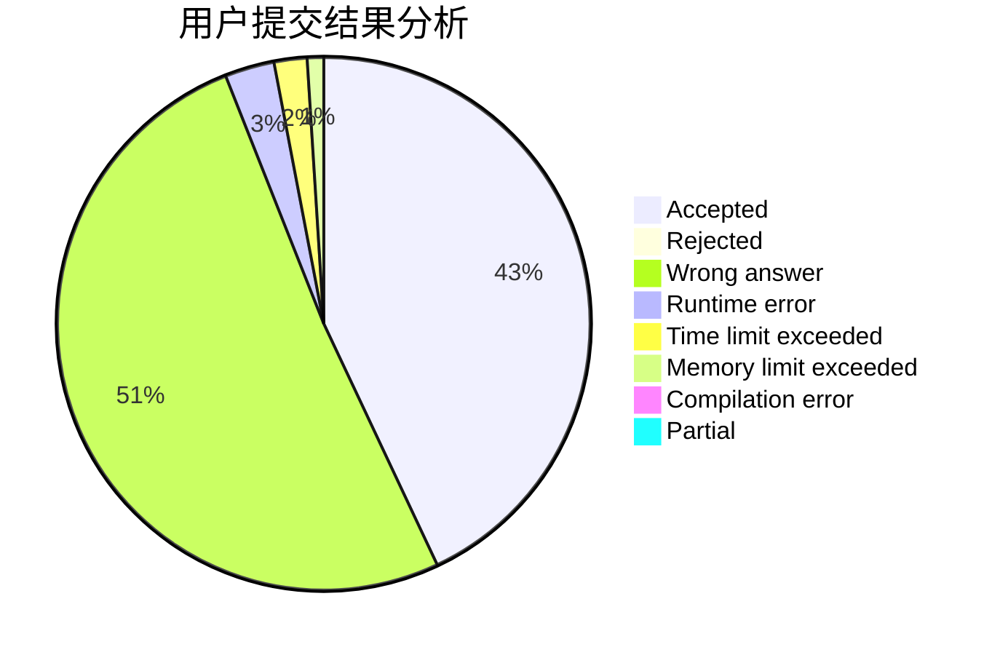
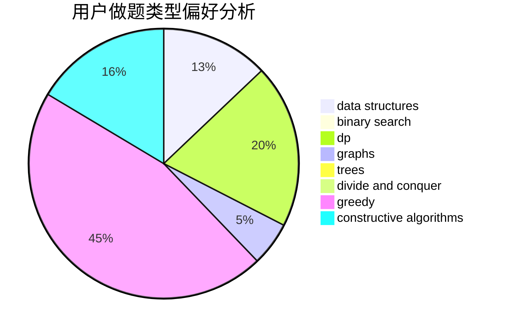

# hnust_lizhihao

<!-- tabs:start -->

#### **用户提交结果分析**

#### **用户做题类型偏好分析**

#### **用户错题知识点分析**

<!-- tabs:end -->
# 推荐题目
[903D](https://codeforces.com/contest/903/problem/D)		data structures,
                        math		  
[1442A](https://codeforces.com/contest/1442/problem/A)		constructive algorithms,
                        dp,
                        greedy		  
[1067B](https://codeforces.com/contest/1067/problem/B)		dfs and similar,
                        graphs,
                        shortest paths		  
[166E](https://codeforces.com/contest/166/problem/E)		dp,
                        math,
                        matrices		  
[549E](https://codeforces.com/contest/549/problem/E)		geometry,
                        math		  
[1173A](https://codeforces.com/contest/1173/problem/A)		greedy		  
[709E](https://codeforces.com/contest/709/problem/E)		dsu,graphs,sortings,trees		  
[671C](https://codeforces.com/contest/671/problem/C)		data structures,
                        number theory		  
[989A](https://codeforces.com/contest/989/problem/A)		implementation,
                        strings		  
[445A](https://codeforces.com/contest/445/problem/A)		dfs and similar,
                        implementation		  
