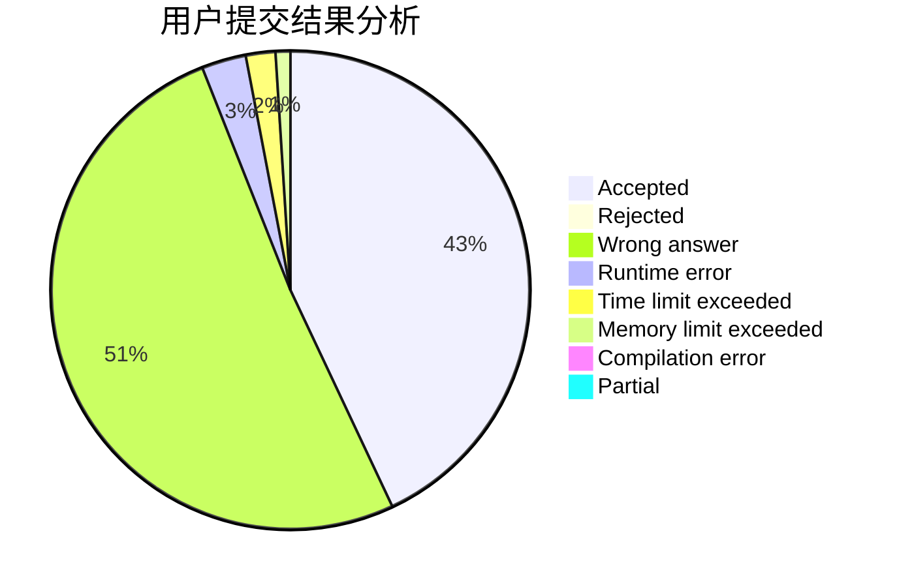
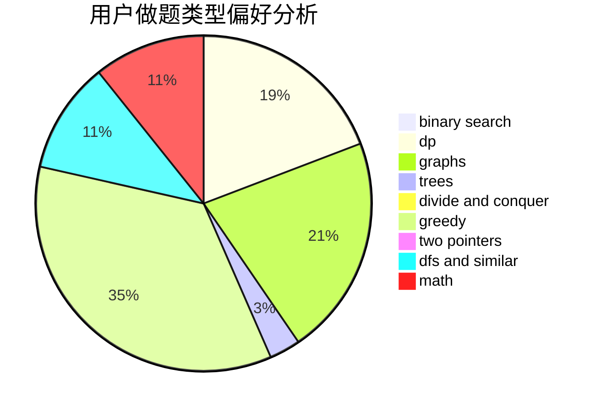

# hnust_lizhihao

<!-- tabs:start -->

#### **用户提交结果分析**

#### **用户做题类型偏好分析**

<!-- tabs:end -->
# 推荐题目
[903D](https://codeforces.com/contest/903/problem/D)
[1442A](https://codeforces.com/contest/1442/problem/A)
[1067B](https://codeforces.com/contest/1067/problem/B)
[166E](https://codeforces.com/contest/166/problem/E)
[549E](https://codeforces.com/contest/549/problem/E)
[1173A](https://codeforces.com/contest/1173/problem/A)
[709E](https://codeforces.com/contest/709/problem/E)
[671C](https://codeforces.com/contest/671/problem/C)
[989A](https://codeforces.com/contest/989/problem/A)
[445A](https://codeforces.com/contest/445/problem/A)
