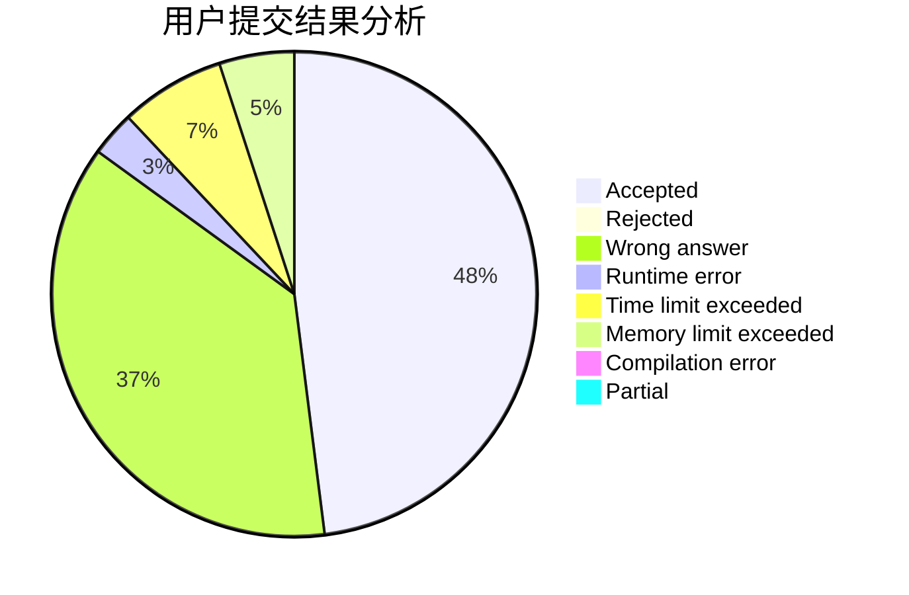
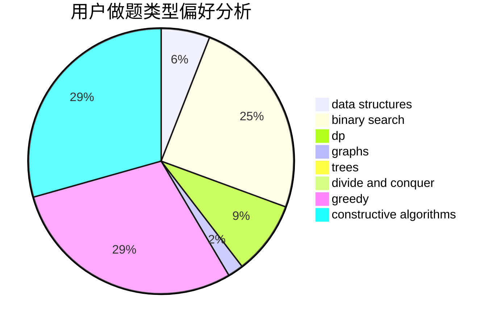
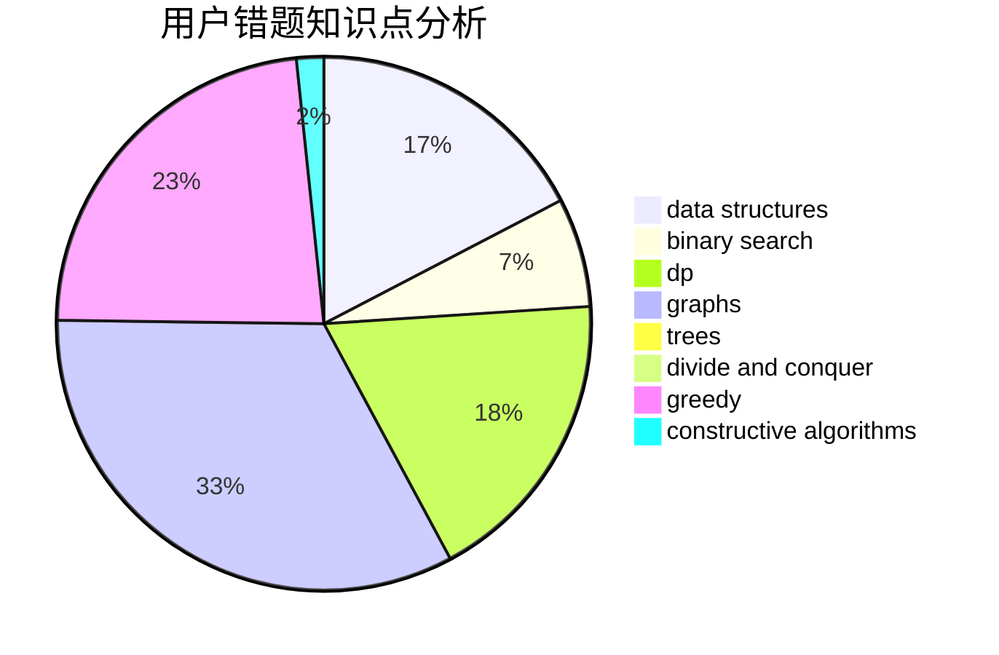

# hnust_luochaoyi

<!-- tabs:start -->

#### **用户提交结果分析**

#### **用户做题类型偏好分析**

#### **用户错题知识点分析**

<!-- tabs:end -->
# 推荐题目
[1474A](https://codeforces.com/contest/1474/problem/A)		greedy		  
[318C](https://codeforces.com/contest/318/problem/C)		dsu,graphs,sortings,trees		  
[383E](https://codeforces.com/contest/383/problem/E)		combinatorics,
                        divide and conquer,
                        dp		  
[11082](https://codeforces.com/contest/1108/problem/2)		dsu,graphs,sortings,trees		  
[540C](https://codeforces.com/contest/540/problem/C)		dfs and similar		  
[229D](https://codeforces.com/contest/229/problem/D)		dp,
                        greedy,
                        two pointers		  
[630C](https://codeforces.com/contest/630/problem/C)		combinatorics,
                        math		  
[840D](https://codeforces.com/contest/840/problem/D)		data structures,
                        probabilities		  
[451D](https://codeforces.com/contest/451/problem/D)		math		  
[102B](https://codeforces.com/contest/102/problem/B)		implementation		  
