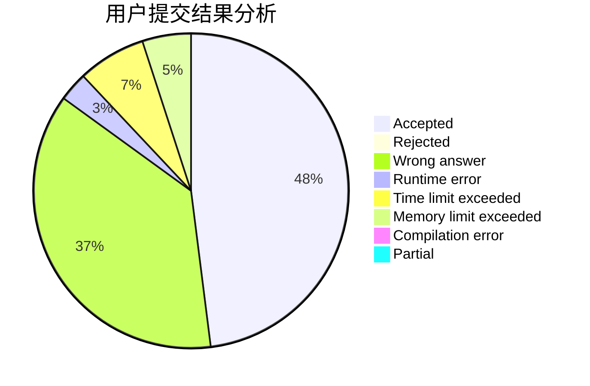
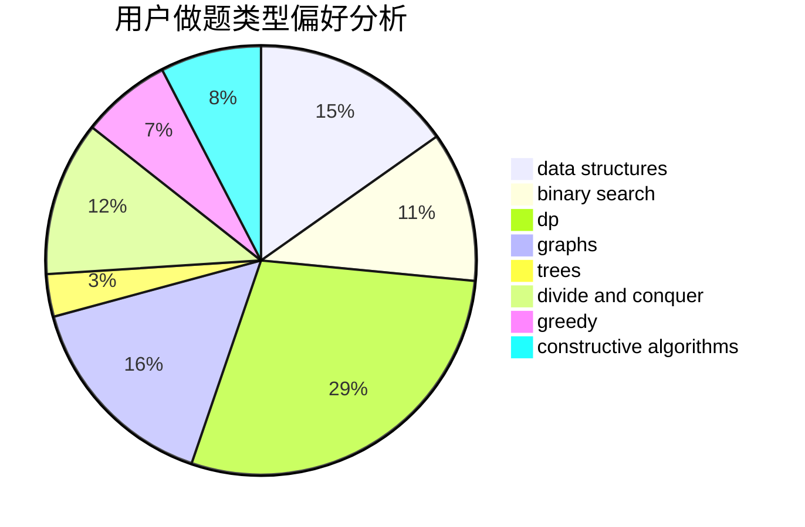
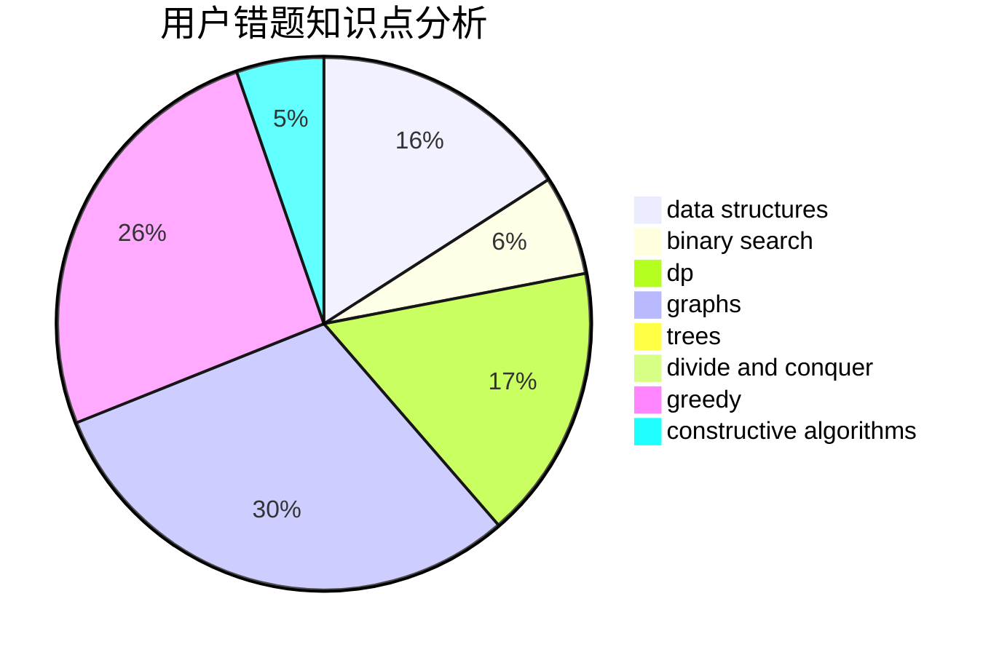

# hnust_luochaoyi

<!-- tabs:start -->

#### **用户提交结果分析**

#### **用户做题类型偏好分析**

#### **用户错题知识点分析**

<!-- tabs:end -->
# 推荐题目
[1466H](https://codeforces.com/contest/1466/problem/H)		combinatorics,
                        dp,
                        graphs,
                        greedy,
                        math		  
[300A](https://codeforces.com/contest/300/problem/A)		brute force,
                        constructive algorithms,
                        implementation		  
[358D](https://codeforces.com/contest/358/problem/D)		dp,
                        greedy		  
[1107E](https://codeforces.com/contest/1107/problem/E)		dp		  
[514E](https://codeforces.com/contest/514/problem/E)		dp,
                        matrices		  
[205B](https://codeforces.com/contest/205/problem/B)		brute force,
                        greedy		  
[611B](https://codeforces.com/contest/611/problem/B)		bitmasks,
                        brute force,
                        implementation		  
[820D](https://codeforces.com/contest/820/problem/D)		dsu,graphs,sortings,trees		  
[42A](https://codeforces.com/contest/42/problem/A)		greedy,
                        implementation		  
[1029E](https://codeforces.com/contest/1029/problem/E)		dp,
                        graphs,
                        greedy		  
