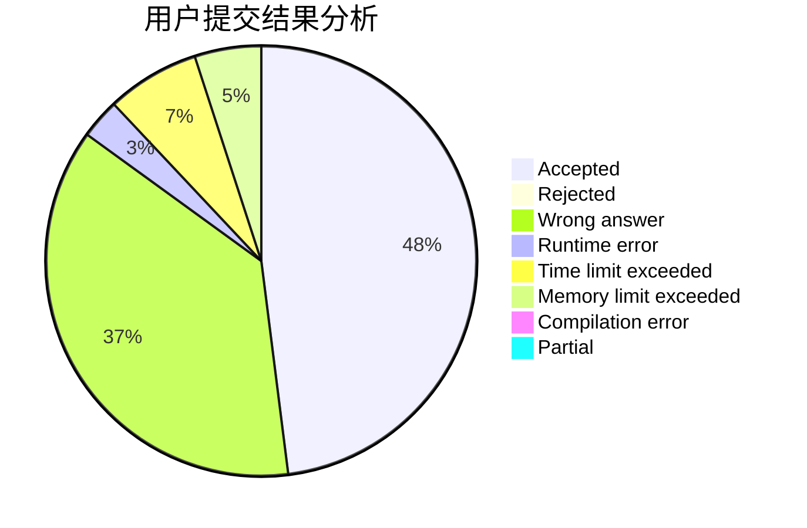
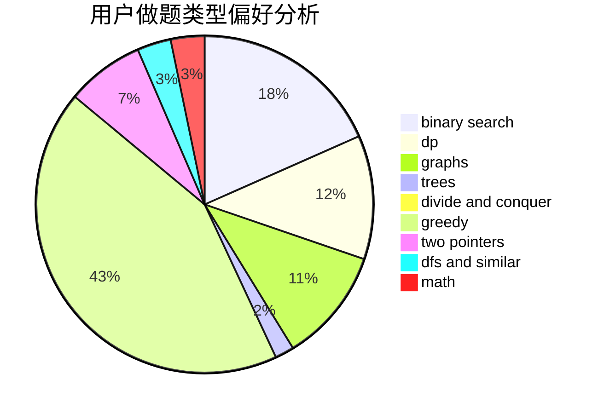

# hnust_luochaoyi

<!-- tabs:start -->

#### **用户提交结果分析**

#### **用户做题类型偏好分析**

<!-- tabs:end -->
# 推荐题目
[1474A](https://codeforces.com/contest/1474/problem/A)
[318C](https://codeforces.com/contest/318/problem/C)
[383E](https://codeforces.com/contest/383/problem/E)
[11082](https://codeforces.com/contest/1108/problem/2)
[540C](https://codeforces.com/contest/540/problem/C)
[229D](https://codeforces.com/contest/229/problem/D)
[630C](https://codeforces.com/contest/630/problem/C)
[840D](https://codeforces.com/contest/840/problem/D)
[451D](https://codeforces.com/contest/451/problem/D)
[102B](https://codeforces.com/contest/102/problem/B)
