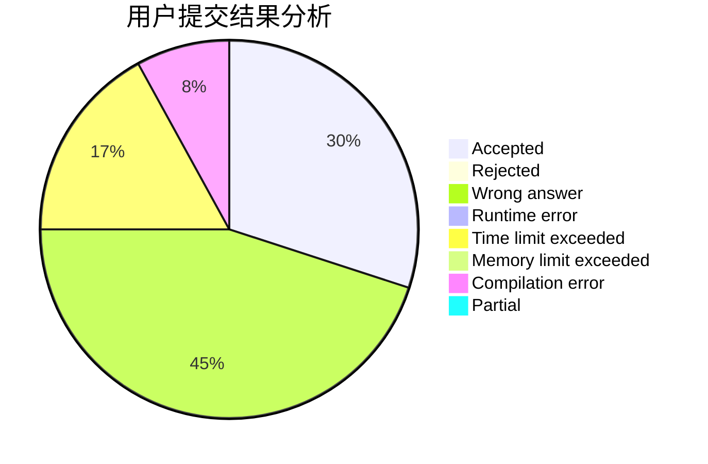
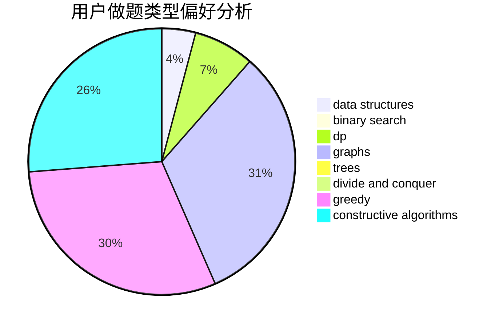
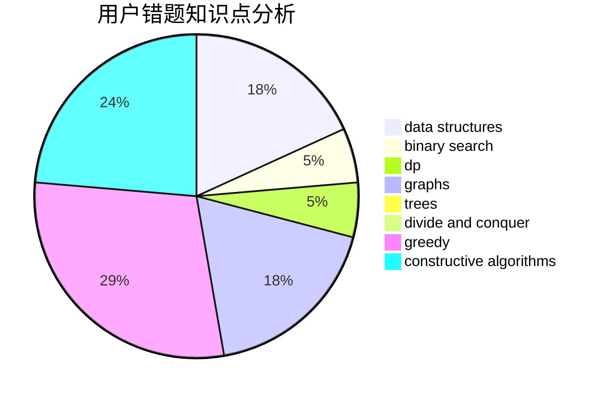

# hnust_pandehao

<!-- tabs:start -->

#### **用户提交结果分析**

#### **用户做题类型偏好分析**

#### **用户错题知识点分析**

<!-- tabs:end -->
# 推荐题目
[558D](https://codeforces.com/contest/558/problem/D)		data structures,
                        implementation,
                        sortings		  
[1195D2](https://codeforces.com/contest/1195D/problem/2)		combinatorics,
                        math,
                        number theory		  
[975A](https://codeforces.com/contest/975/problem/A)		implementation,
                        strings		  
[1051A](https://codeforces.com/contest/1051/problem/A)		greedy,
                        implementation,
                        strings		  
[956B](https://codeforces.com/contest/956/problem/B)		dsu,graphs,sortings,trees		  
[721C](https://codeforces.com/contest/721/problem/C)		dp,
                        graphs		  
[160C](https://codeforces.com/contest/160/problem/C)		implementation,
                        math,
                        sortings		  
[1221G](https://codeforces.com/contest/1221/problem/G)		bitmasks,
                        brute force,
                        combinatorics,
                        dp,
                        meet-in-the-middle		  
[1250M](https://codeforces.com/contest/1250/problem/M)		constructive algorithms,
                        divide and conquer		  
[593E](https://codeforces.com/contest/593/problem/E)		dp,
                        matrices		  
