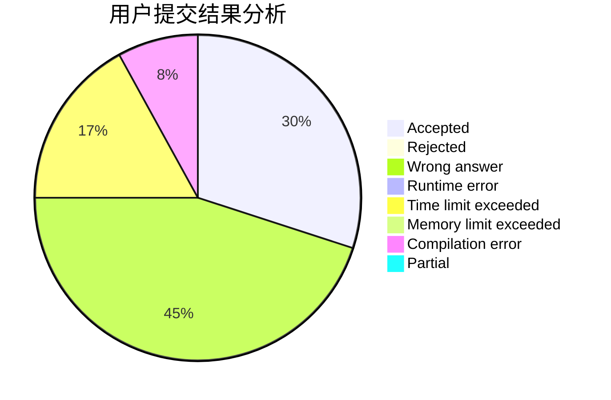
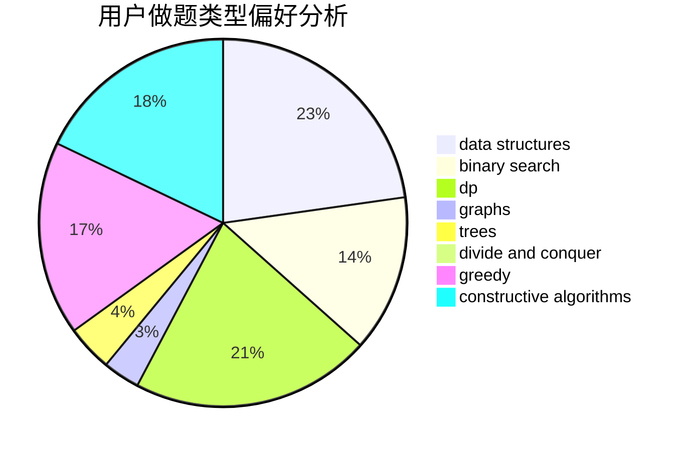
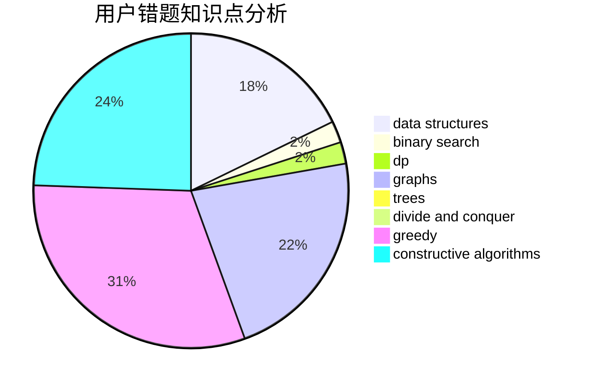

# hnust_pandehao

<!-- tabs:start -->

#### **用户提交结果分析**

#### **用户做题类型偏好分析**

#### **用户错题知识点分析**

<!-- tabs:end -->
# 推荐题目
[581B](https://codeforces.com/contest/581/problem/B)		implementation,
                        math		  
[119A](https://codeforces.com/contest/119/problem/A)		implementation		  
[989E](https://codeforces.com/contest/989/problem/E)		dp,
                        geometry,
                        matrices,
                        probabilities		  
[1051D](https://codeforces.com/contest/1051/problem/D)		bitmasks,
                        dp		  
[977F](https://codeforces.com/contest/977/problem/F)		dp		  
[739A](https://codeforces.com/contest/739/problem/A)		constructive algorithms,
                        greedy		  
[185E](https://codeforces.com/contest/185/problem/E)		binary search,
                        data structures		  
[122C](https://codeforces.com/contest/122/problem/C)		dsu,graphs,sortings,trees		  
[1255D](https://codeforces.com/contest/1255/problem/D)		dsu,graphs,sortings,trees		  
[612B](https://codeforces.com/contest/612/problem/B)		implementation,
                        math		  
