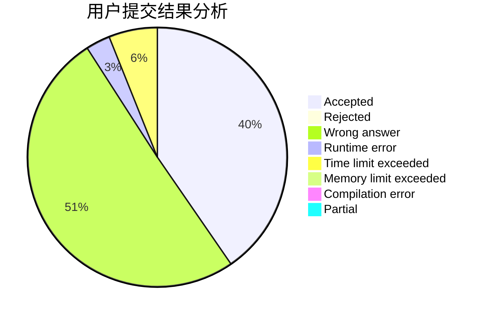
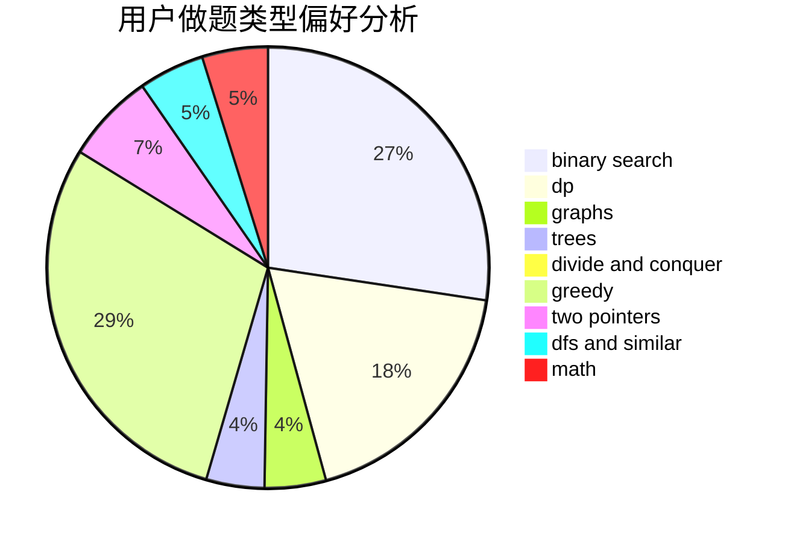

# hnust_qinhaoyuan

<!-- tabs:start -->

#### **用户提交结果分析**

#### **用户做题类型偏好分析**

<!-- tabs:end -->
# 推荐题目
[14621](https://codeforces.com/contest/1462/problem/1)
[746D](https://codeforces.com/contest/746/problem/D)
[292A](https://codeforces.com/contest/292/problem/A)
[727A](https://codeforces.com/contest/727/problem/A)
[1415E](https://codeforces.com/contest/1415/problem/E)
[101D](https://codeforces.com/contest/101/problem/D)
[689A](https://codeforces.com/contest/689/problem/A)
[898B](https://codeforces.com/contest/898/problem/B)
[281D](https://codeforces.com/contest/281/problem/D)
[988A](https://codeforces.com/contest/988/problem/A)
