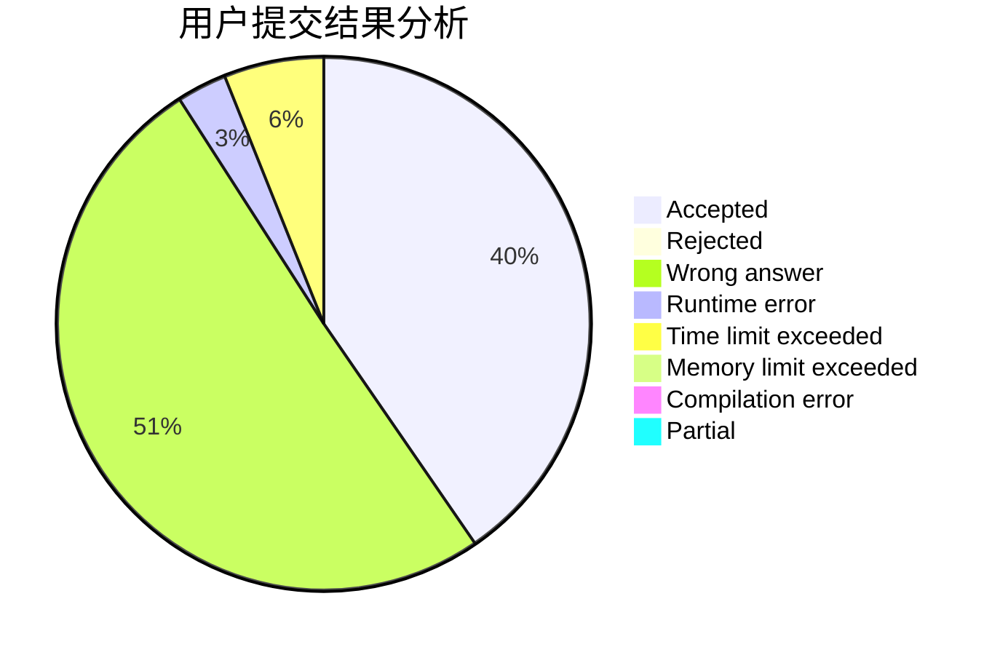
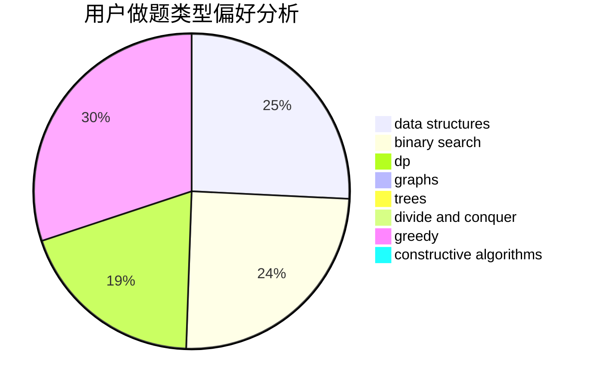

# hnust_qinhaoyuan

<!-- tabs:start -->

#### **用户提交结果分析**

#### **用户做题类型偏好分析**

#### **用户错题知识点分析**

<!-- tabs:end -->
# 推荐题目
[1452D](https://codeforces.com/contest/1452/problem/D)		combinatorics,
                        dp,
                        math		  
[729D](https://codeforces.com/contest/729/problem/D)		constructive algorithms,
                        greedy,
                        math		  
[277B](https://codeforces.com/contest/277/problem/B)		constructive algorithms,
                        geometry		  
[708A](https://codeforces.com/contest/708/problem/A)		constructive algorithms,
                        greedy,
                        implementation,
                        strings		  
[1404C](https://codeforces.com/contest/1404/problem/C)		binary search,
                        constructive algorithms,
                        data structures,
                        greedy,
                        two pointers		  
[1019D](https://codeforces.com/contest/1019/problem/D)		binary search,
                        geometry,
                        sortings		  
[667A](https://codeforces.com/contest/667/problem/A)		geometry,
                        math		  
[877C](https://codeforces.com/contest/877/problem/C)		constructive algorithms		  
[266A](https://codeforces.com/contest/266/problem/A)		implementation		  
[966B](https://codeforces.com/contest/966/problem/B)		dsu,graphs,sortings,trees		  
