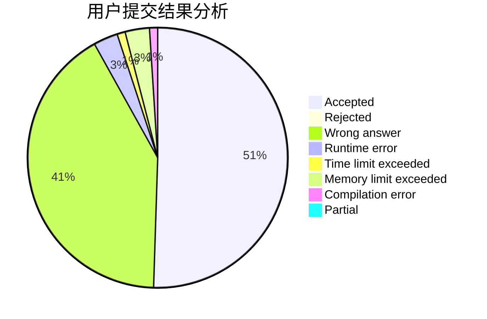
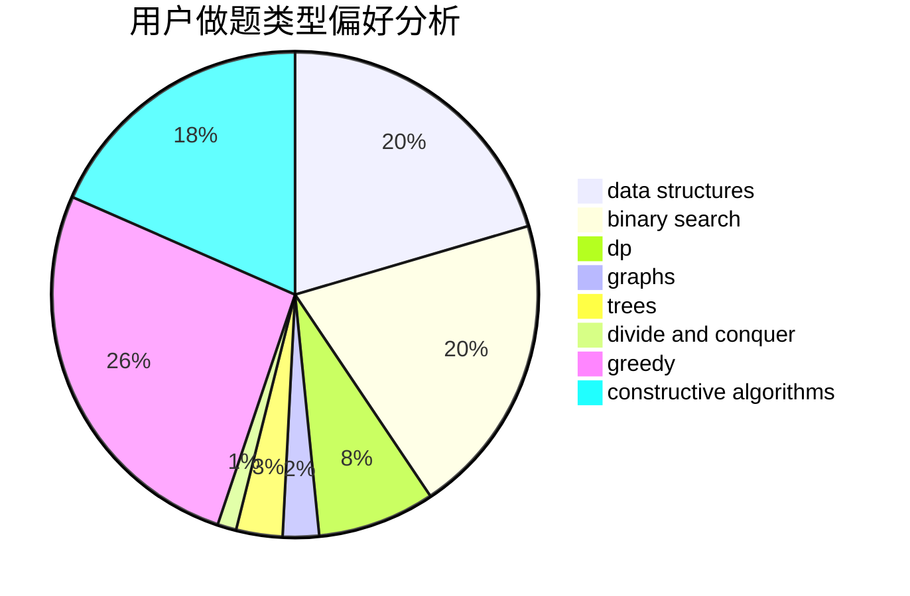
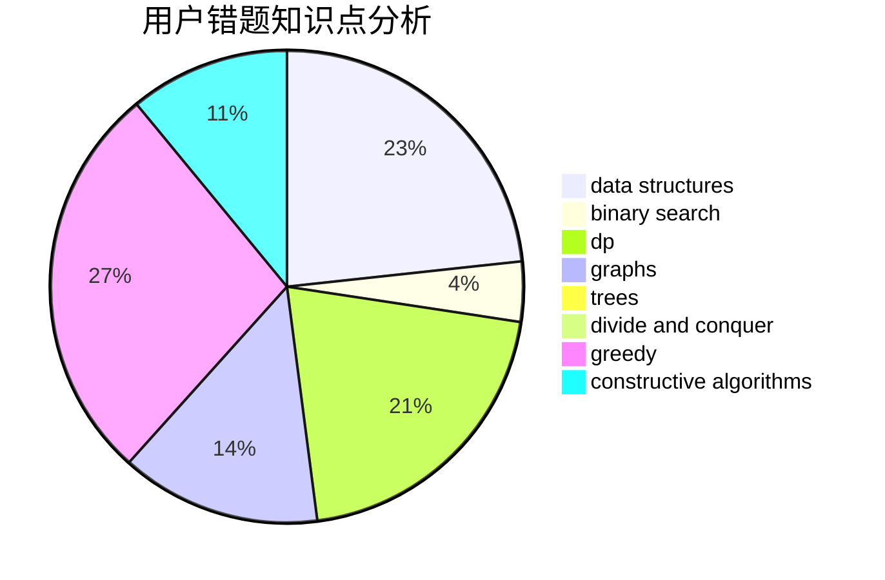

# 123ZDQ

<!-- tabs:start -->

#### **用户提交结果分析**

#### **用户做题类型偏好分析**

#### **用户错题知识点分析**

<!-- tabs:end -->
# 推荐题目
[1116C3](https://codeforces.com/contest/1116C/problem/3)		nan		  
[1115U3](https://codeforces.com/contest/1115U/problem/3)		*special problem		  
[1117F](https://codeforces.com/contest/1117/problem/F)		bitmasks,
                        dp		  
[1117A](https://codeforces.com/contest/1117/problem/A)		implementation,
                        math		  
[1117B](https://codeforces.com/contest/1117/problem/B)		greedy,
                        math,
                        sortings		  
[1111A](https://codeforces.com/contest/1111/problem/A)		implementation,
                        strings		  
[1116C2](https://codeforces.com/contest/1116C/problem/2)		nan		  
[1118A](https://codeforces.com/contest/1118/problem/A)		math		  
[1111B](https://codeforces.com/contest/1111/problem/B)		brute force,
                        implementation,
                        math		  
[1114D](https://codeforces.com/contest/1114/problem/D)		dp		  
