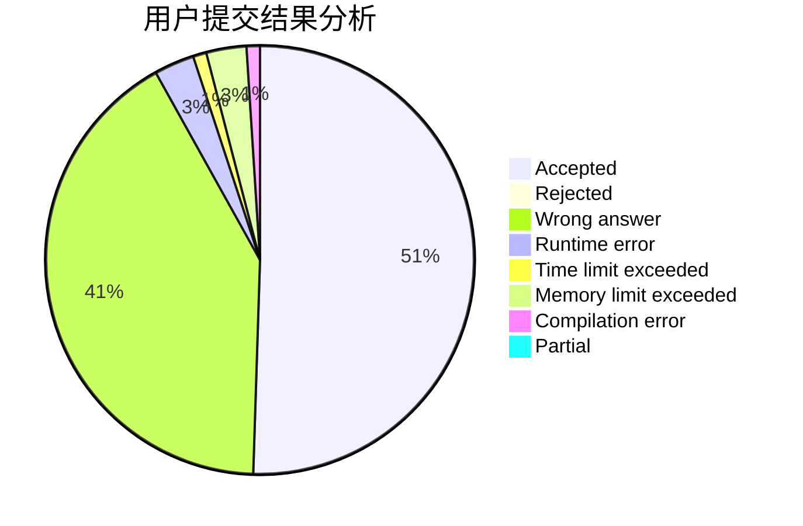
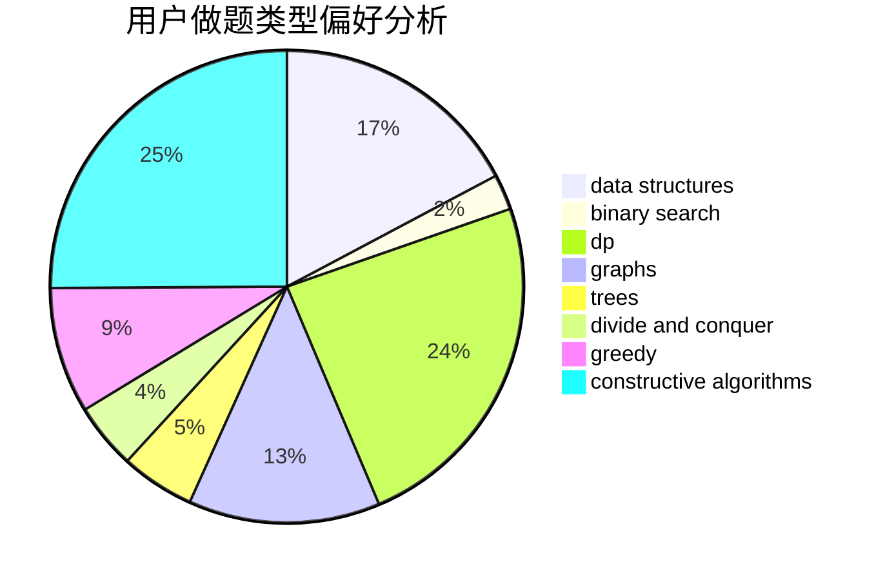
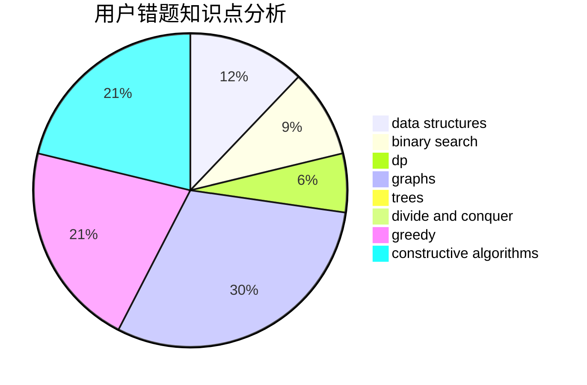

# 123ZDQ

<!-- tabs:start -->

#### **用户提交结果分析**

#### **用户做题类型偏好分析**

#### **用户错题知识点分析**

<!-- tabs:end -->
# 推荐题目
[11182](https://codeforces.com/contest/1118/problem/2)		dsu,graphs,sortings,trees		  
[1117C](https://codeforces.com/contest/1117/problem/C)		binary search		  
[1119D](https://codeforces.com/contest/1119/problem/D)		binary search,
                        sortings		  
[1118E](https://codeforces.com/contest/1118/problem/E)		constructive algorithms,
                        implementation		  
[1119A](https://codeforces.com/contest/1119/problem/A)		greedy,
                        implementation		  
[1111E](https://codeforces.com/contest/1111/problem/E)		data structures,
                        dfs and similar,
                        dp,
                        graphs,
                        trees		  
[11181](https://codeforces.com/contest/1118/problem/1)		dsu,graphs,sortings,trees		  
[1119F](https://codeforces.com/contest/1119/problem/F)		data structures,
                        dp,
                        trees		  
[1113A](https://codeforces.com/contest/1113/problem/A)		dp,
                        greedy,
                        math		  
[11151](https://codeforces.com/contest/1115/problem/1)		dsu,graphs,sortings,trees		  
