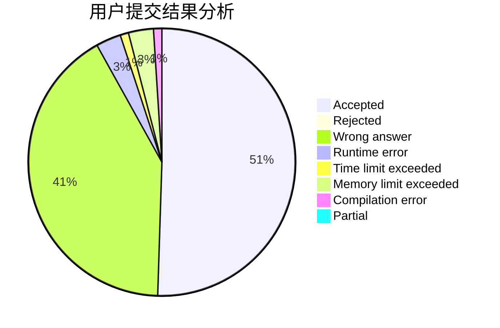
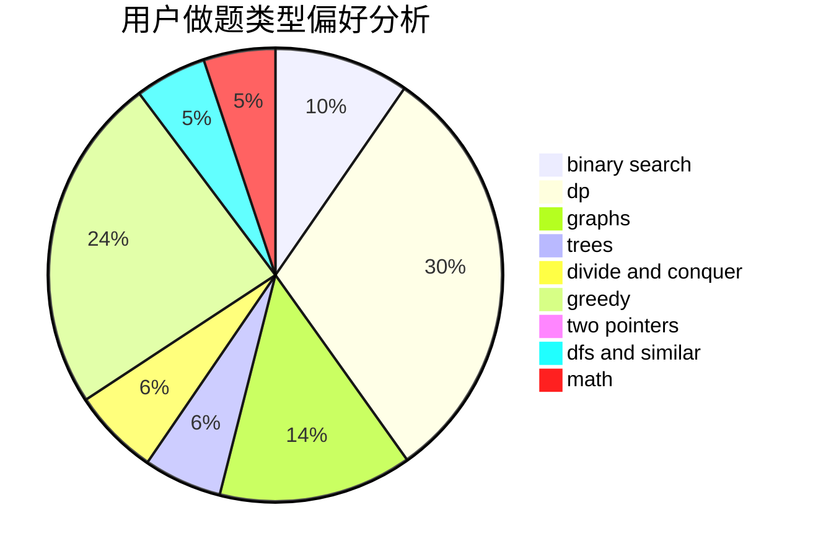

# 123ZDQ

<!-- tabs:start -->

#### **用户提交结果分析**

#### **用户做题类型偏好分析**

<!-- tabs:end -->
# 推荐题目
[11182](https://codeforces.com/contest/1118/problem/2)
[1117C](https://codeforces.com/contest/1117/problem/C)
[1119D](https://codeforces.com/contest/1119/problem/D)
[1118E](https://codeforces.com/contest/1118/problem/E)
[1119A](https://codeforces.com/contest/1119/problem/A)
[1111E](https://codeforces.com/contest/1111/problem/E)
[11181](https://codeforces.com/contest/1118/problem/1)
[1119F](https://codeforces.com/contest/1119/problem/F)
[1113A](https://codeforces.com/contest/1113/problem/A)
[11151](https://codeforces.com/contest/1115/problem/1)
