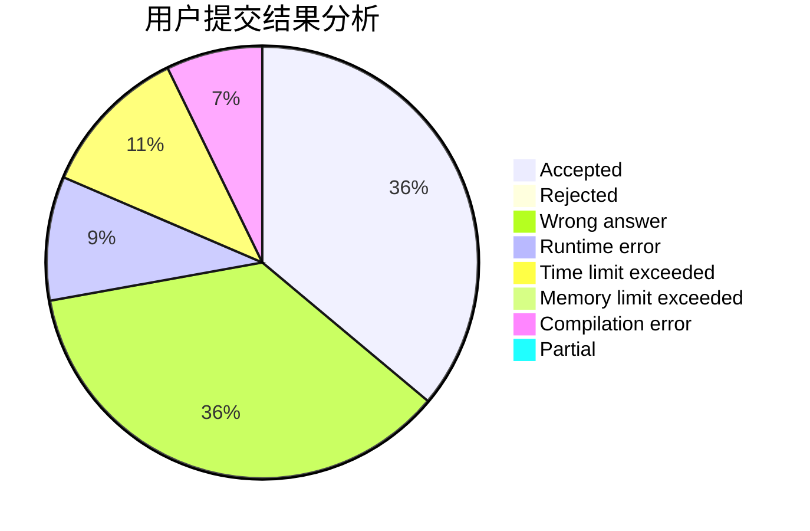
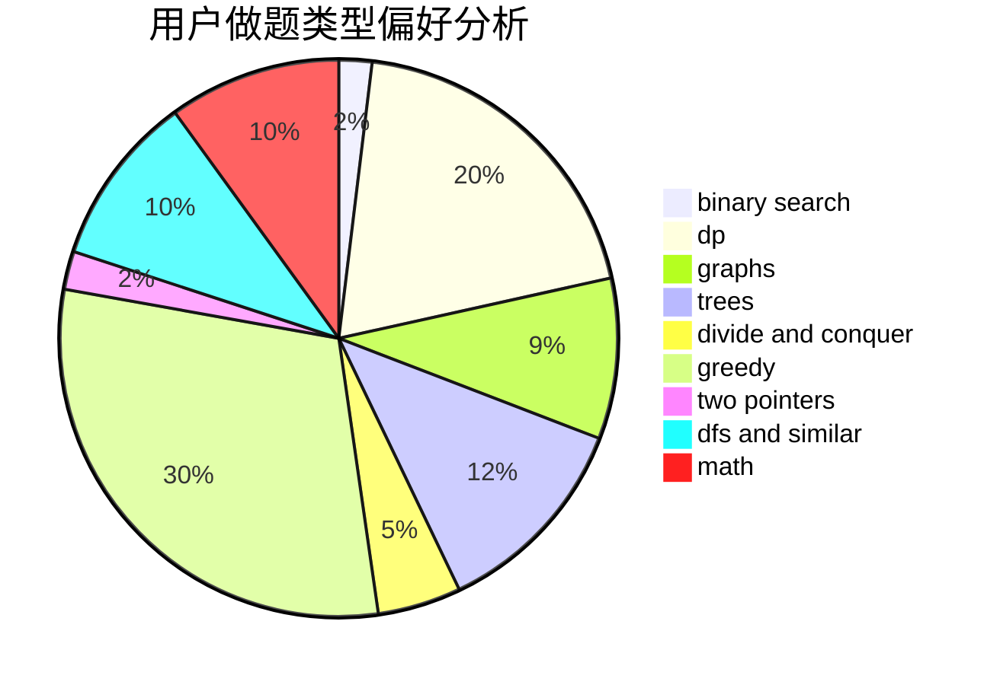

# Bakapiano

<!-- tabs:start -->

#### **用户提交结果分析**

#### **用户做题类型偏好分析**

<!-- tabs:end -->
# 推荐题目
[497D](https://codeforces.com/contest/497/problem/D)
[1413D](https://codeforces.com/contest/1413/problem/D)
[496B](https://codeforces.com/contest/496/problem/B)
[498B](https://codeforces.com/contest/498/problem/B)
[1297D](https://codeforces.com/contest/1297/problem/D)
[1245C](https://codeforces.com/contest/1245/problem/C)
[183A](https://codeforces.com/contest/183/problem/A)
[498A](https://codeforces.com/contest/498/problem/A)
[106B](https://codeforces.com/contest/106/problem/B)
[498D](https://codeforces.com/contest/498/problem/D)
