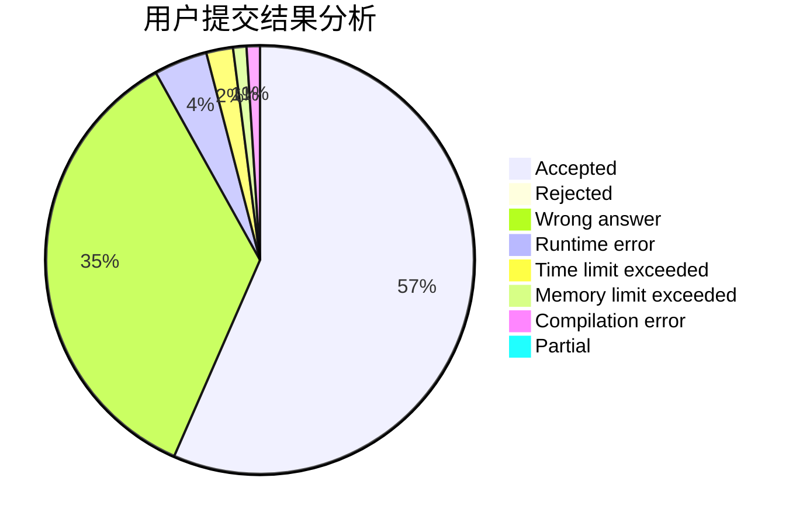
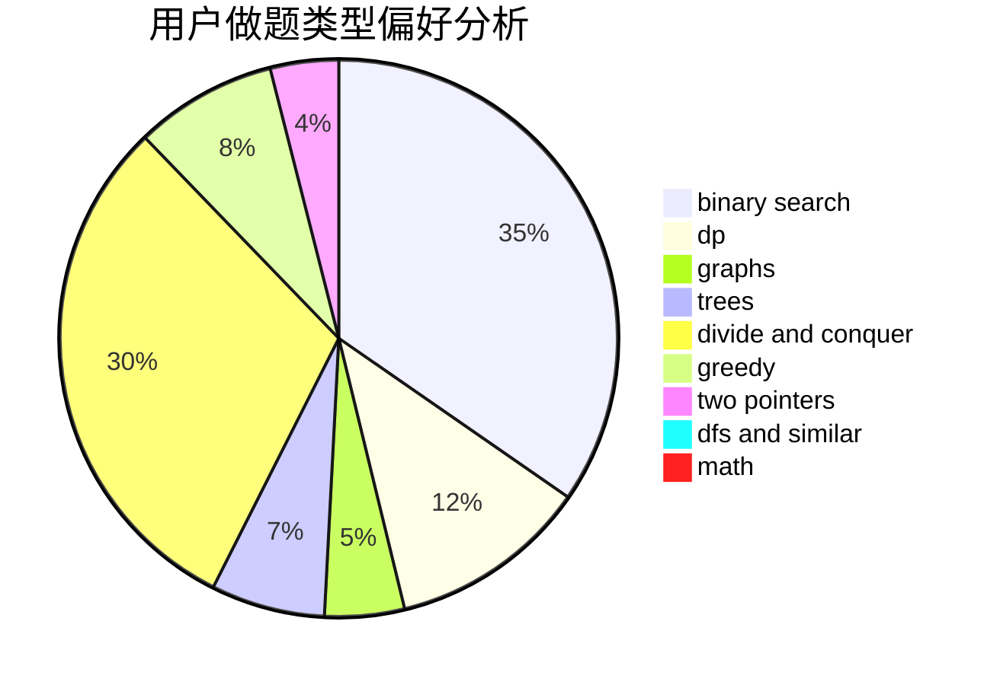

# hnust_ruanjiangnan

<!-- tabs:start -->

#### **用户提交结果分析**

#### **用户做题类型偏好分析**

<!-- tabs:end -->
# 推荐题目
[1458A](https://codeforces.com/contest/1458/problem/A)
[464E](https://codeforces.com/contest/464/problem/E)
[1004C](https://codeforces.com/contest/1004/problem/C)
[835B](https://codeforces.com/contest/835/problem/B)
[1194C](https://codeforces.com/contest/1194/problem/C)
[377E](https://codeforces.com/contest/377/problem/E)
[868E](https://codeforces.com/contest/868/problem/E)
[24B](https://codeforces.com/contest/24/problem/B)
[845A](https://codeforces.com/contest/845/problem/A)
[1465B](https://codeforces.com/contest/1465/problem/B)
