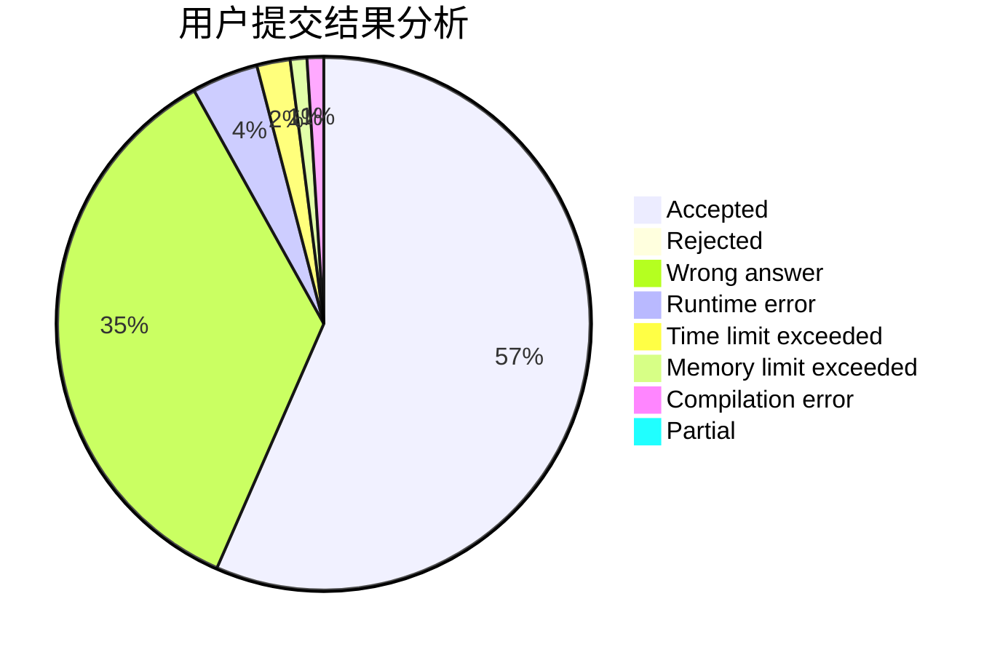
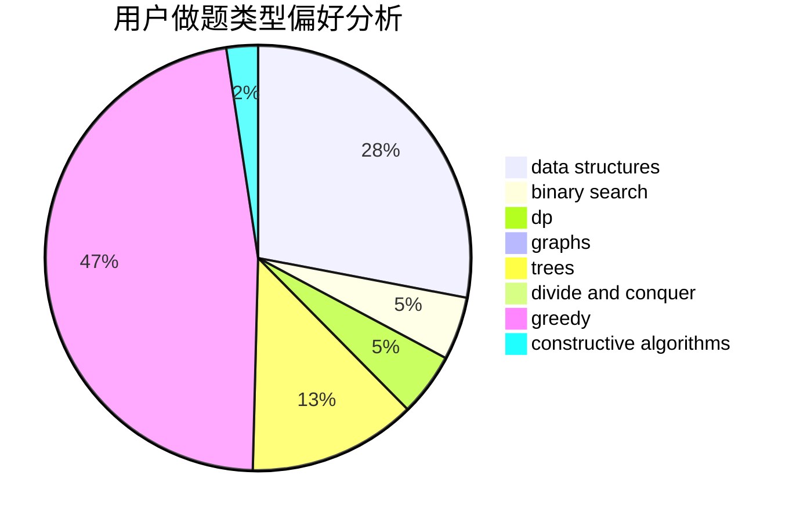
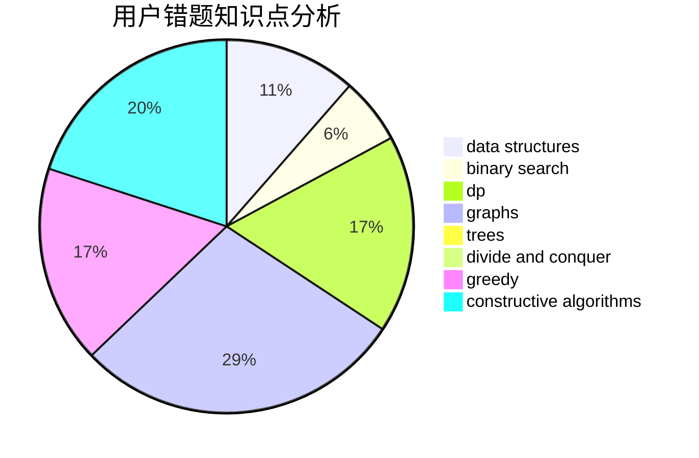

# hnust_ruanjiangnan

<!-- tabs:start -->

#### **用户提交结果分析**

#### **用户做题类型偏好分析**

#### **用户错题知识点分析**

<!-- tabs:end -->
# 推荐题目
[144D](https://codeforces.com/contest/144/problem/D)		data structures,
                        dfs and similar,
                        graphs,
                        shortest paths		  
[445A](https://codeforces.com/contest/445/problem/A)		dfs and similar,
                        implementation		  
[1003F](https://codeforces.com/contest/1003/problem/F)		dp,
                        hashing,
                        strings		  
[816A](https://codeforces.com/contest/816/problem/A)		brute force,
                        implementation		  
[1189A](https://codeforces.com/contest/1189/problem/A)		strings		  
[351C](https://codeforces.com/contest/351/problem/C)		dp,
                        matrices		  
[84A](https://codeforces.com/contest/84/problem/A)		math,
                        number theory		  
[229E](https://codeforces.com/contest/229/problem/E)		combinatorics,
                        dp,
                        math,
                        probabilities		  
[825E](https://codeforces.com/contest/825/problem/E)		data structures,
                        dfs and similar,
                        graphs,
                        greedy		  
[1455E](https://codeforces.com/contest/1455/problem/E)		brute force,
                        constructive algorithms,
                        flows,
                        geometry,
                        greedy,
                        implementation,
                        math,
                        ternary search		  
