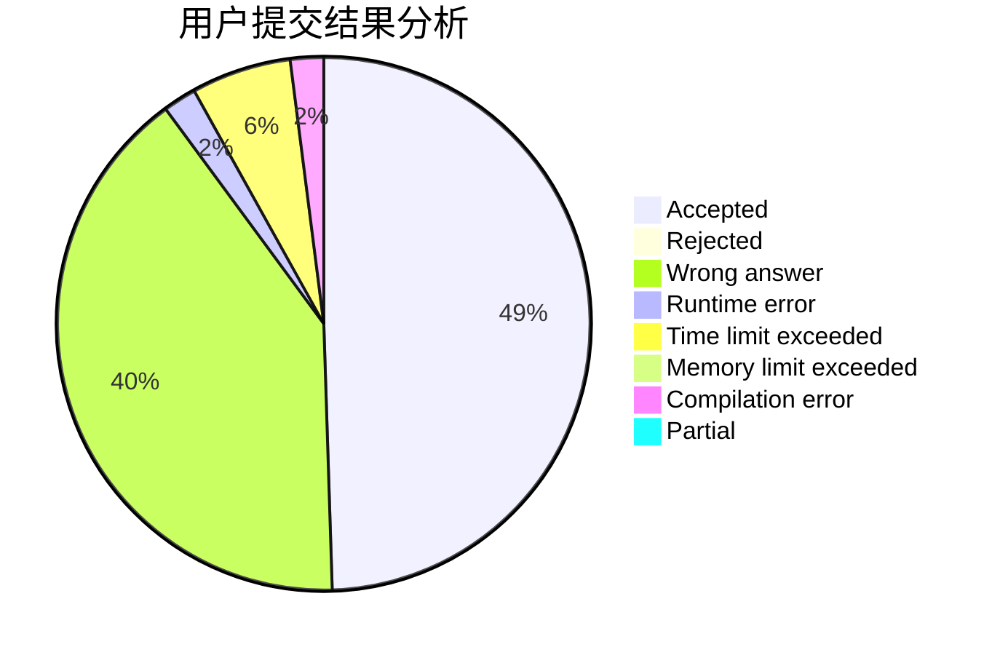
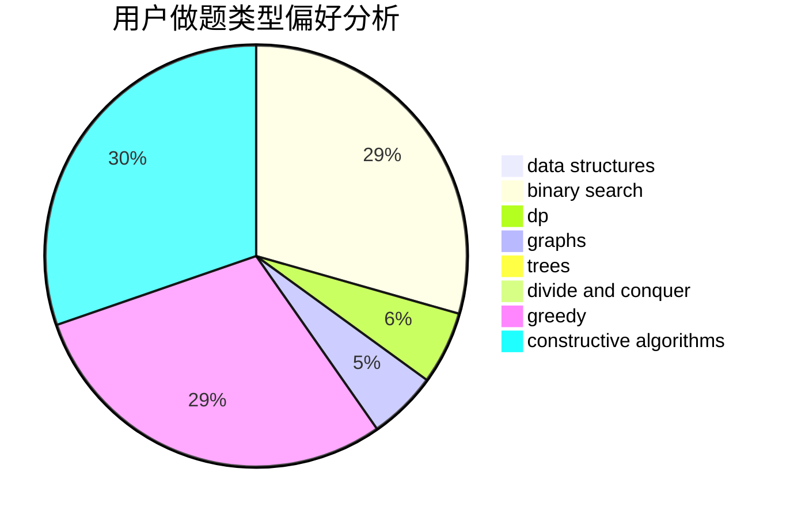
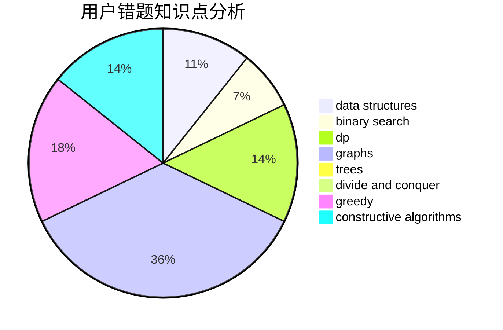

# hnust_sunpangbo

<!-- tabs:start -->

#### **用户提交结果分析**

#### **用户做题类型偏好分析**

#### **用户错题知识点分析**

<!-- tabs:end -->
# 推荐题目
[1505D](https://codeforces.com/contest/1505/problem/D)		number theory		  
[1017D](https://codeforces.com/contest/1017/problem/D)		bitmasks,
                        brute force,
                        data structures		  
[1136E](https://codeforces.com/contest/1136/problem/E)		binary search,
                        data structures		  
[756D](https://codeforces.com/contest/756/problem/D)		brute force,
                        combinatorics,
                        dp,
                        string suffix structures		  
[915A](https://codeforces.com/contest/915/problem/A)		implementation		  
[1409F](https://codeforces.com/contest/1409/problem/F)		dp,
                        strings		  
[1327E](https://codeforces.com/contest/1327/problem/E)		combinatorics,
                        dp,
                        math		  
[1482E](https://codeforces.com/contest/1482/problem/E)		data structures,
                        divide and conquer,
                        dp		  
[1489D](https://codeforces.com/contest/1489/problem/D)		dsu,graphs,sortings,trees		  
[1483E](https://codeforces.com/contest/1483/problem/E)		dsu,graphs,sortings,trees		  
