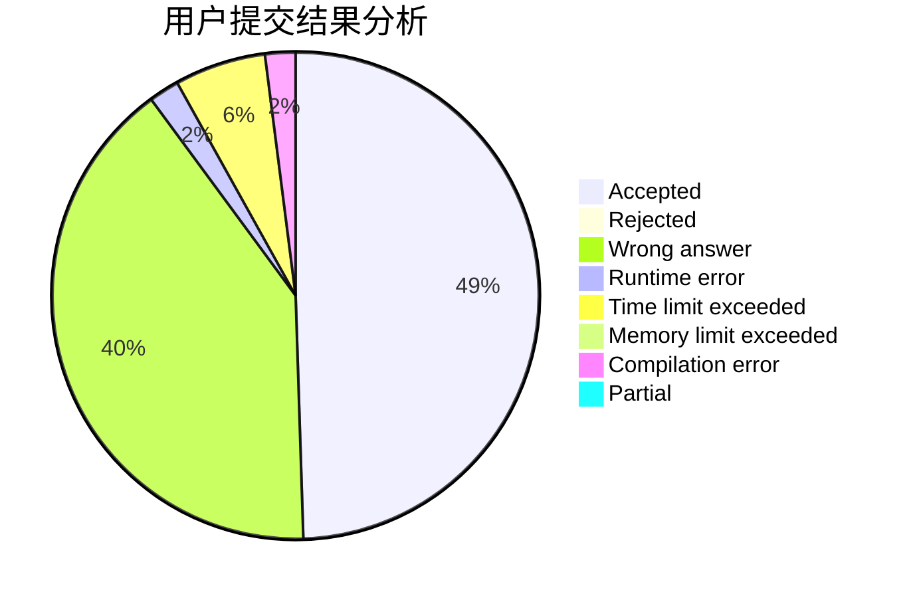
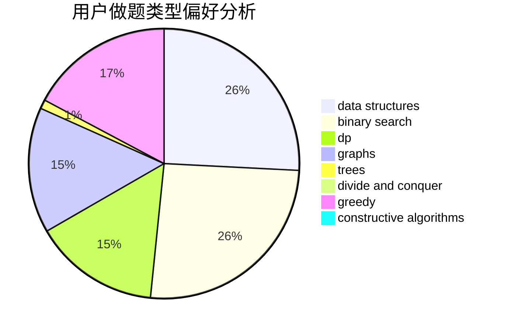
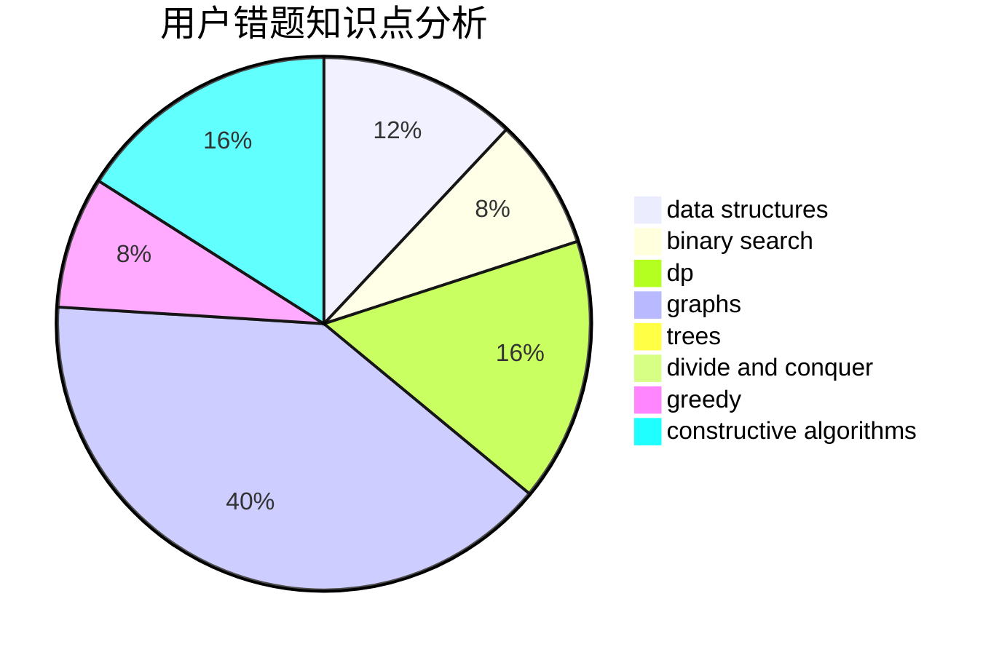

# hnust_sunpangbo

<!-- tabs:start -->

#### **用户提交结果分析**

#### **用户做题类型偏好分析**

#### **用户错题知识点分析**

<!-- tabs:end -->
# 推荐题目
[152E](https://codeforces.com/contest/152/problem/E)		bitmasks,
                        dp,
                        graphs,
                        trees		  
[1017G](https://codeforces.com/contest/1017/problem/G)		data structures		  
[1139A](https://codeforces.com/contest/1139/problem/A)		implementation,
                        strings		  
[776B](https://codeforces.com/contest/776/problem/B)		constructive algorithms,
                        number theory		  
[934E](https://codeforces.com/contest/934/problem/E)		dsu,graphs,sortings,trees		  
[1420A](https://codeforces.com/contest/1420/problem/A)		math,
                        sortings		  
[1334B](https://codeforces.com/contest/1334/problem/B)		greedy,
                        sortings		  
[1490C](https://codeforces.com/contest/1490/problem/C)		binary search,
                        brute force,
                        brute force,
                        math		  
[1497B](https://codeforces.com/contest/1497/problem/B)		constructive algorithms,
                        greedy,
                        math		  
[1491C](https://codeforces.com/contest/1491/problem/C)		brute force,
                        data structures,
                        dp,
                        greedy,
                        implementation		  
