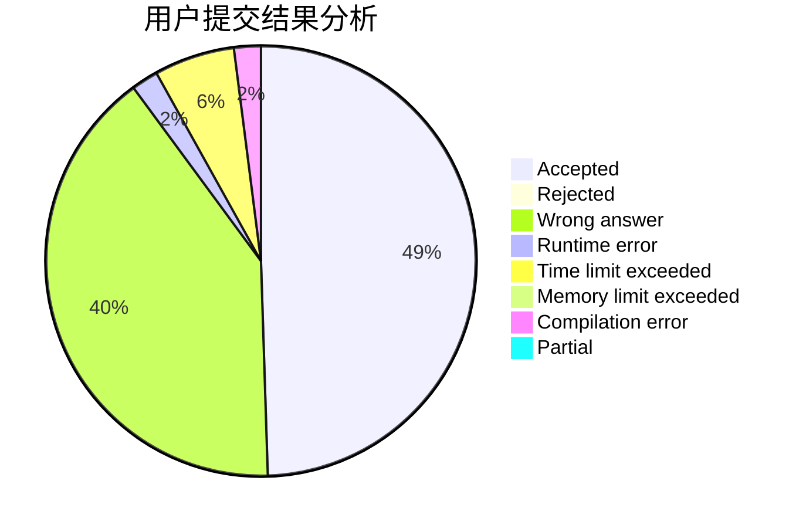
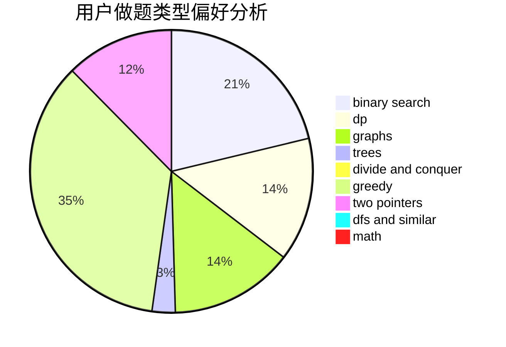

# hnust_sunpangbo

<!-- tabs:start -->

#### **用户提交结果分析**

#### **用户做题类型偏好分析**

<!-- tabs:end -->
# 推荐题目
[152E](https://codeforces.com/contest/152/problem/E)
[1017G](https://codeforces.com/contest/1017/problem/G)
[1139A](https://codeforces.com/contest/1139/problem/A)
[776B](https://codeforces.com/contest/776/problem/B)
[934E](https://codeforces.com/contest/934/problem/E)
[1420A](https://codeforces.com/contest/1420/problem/A)
[1334B](https://codeforces.com/contest/1334/problem/B)
[1490C](https://codeforces.com/contest/1490/problem/C)
[1497B](https://codeforces.com/contest/1497/problem/B)
[1491C](https://codeforces.com/contest/1491/problem/C)
