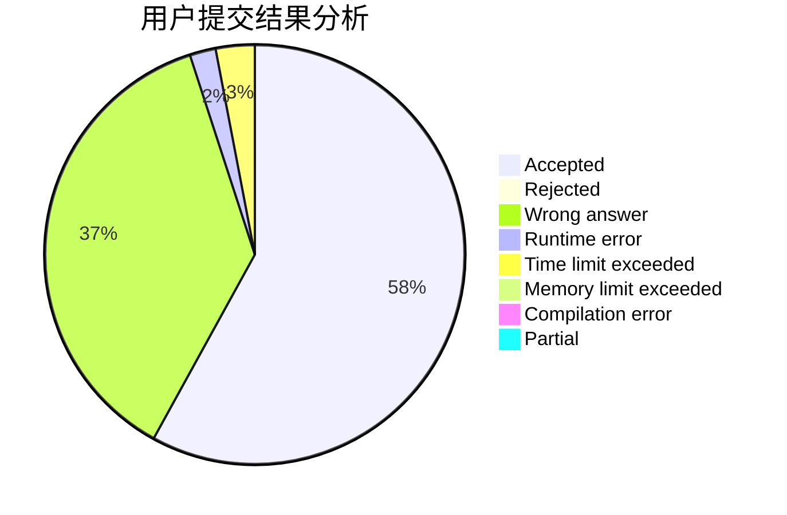
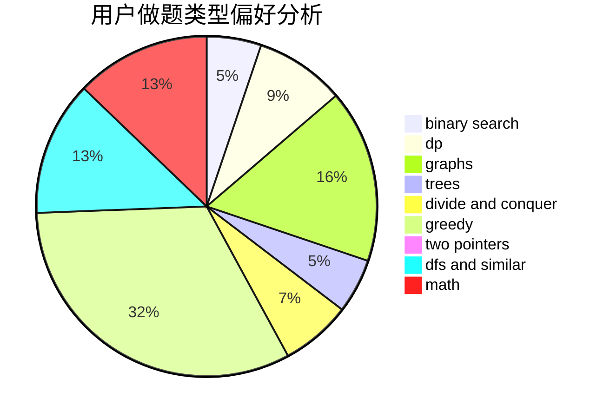

# hnust_tanhua

<!-- tabs:start -->

#### **用户提交结果分析**

#### **用户做题类型偏好分析**

<!-- tabs:end -->
# 推荐题目
[962D](https://codeforces.com/contest/962/problem/D)
[1310B](https://codeforces.com/contest/1310/problem/B)
[913A](https://codeforces.com/contest/913/problem/A)
[1065B](https://codeforces.com/contest/1065/problem/B)
[343A](https://codeforces.com/contest/343/problem/A)
[976F](https://codeforces.com/contest/976/problem/F)
[914E](https://codeforces.com/contest/914/problem/E)
[675E](https://codeforces.com/contest/675/problem/E)
[998E](https://codeforces.com/contest/998/problem/E)
[1161C](https://codeforces.com/contest/1161/problem/C)
