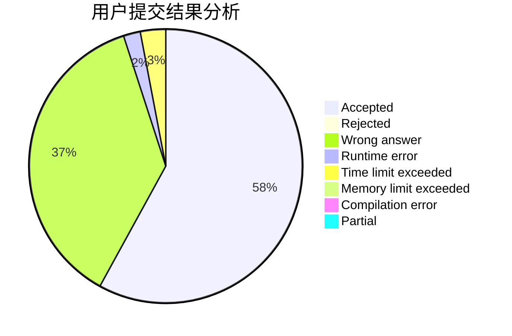
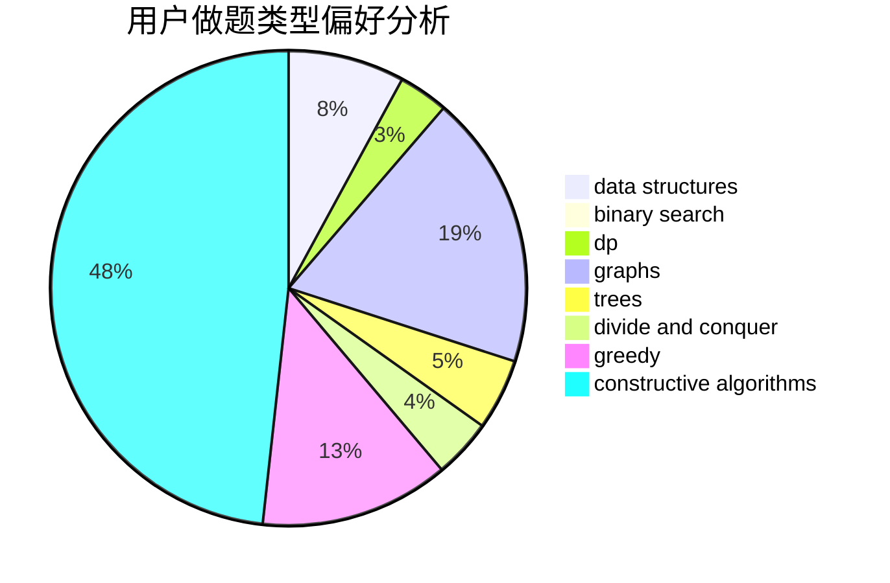
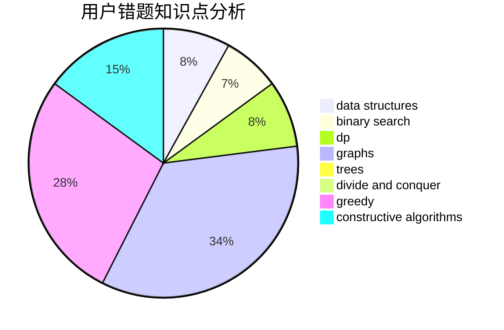

# hnust_tanhua

<!-- tabs:start -->

#### **用户提交结果分析**

#### **用户做题类型偏好分析**

#### **用户错题知识点分析**

<!-- tabs:end -->
# 推荐题目
[946A](https://codeforces.com/contest/946/problem/A)		greedy		  
[1300D](https://codeforces.com/contest/1300/problem/D)		dsu,graphs,sortings,trees		  
[895C](https://codeforces.com/contest/895/problem/C)		bitmasks,
                        combinatorics,
                        dp,
                        math		  
[1064E](https://codeforces.com/contest/1064/problem/E)		dsu,graphs,sortings,trees		  
[316E2](https://codeforces.com/contest/316E/problem/2)		data structures,
                        math		  
[954I](https://codeforces.com/contest/954/problem/I)		fft,
                        math		  
[898C](https://codeforces.com/contest/898/problem/C)		implementation,
                        strings		  
[652A](https://codeforces.com/contest/652/problem/A)		implementation,
                        math		  
[983A](https://codeforces.com/contest/983/problem/A)		implementation,
                        math		  
[1158D](https://codeforces.com/contest/1158/problem/D)		constructive algorithms,
                        geometry,
                        greedy,
                        math		  
