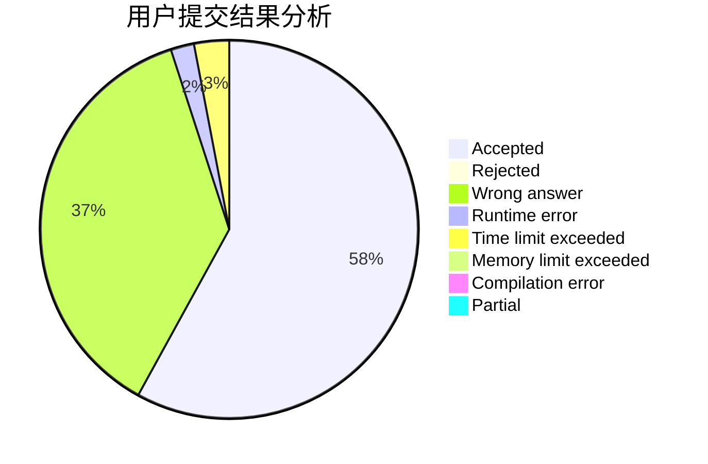
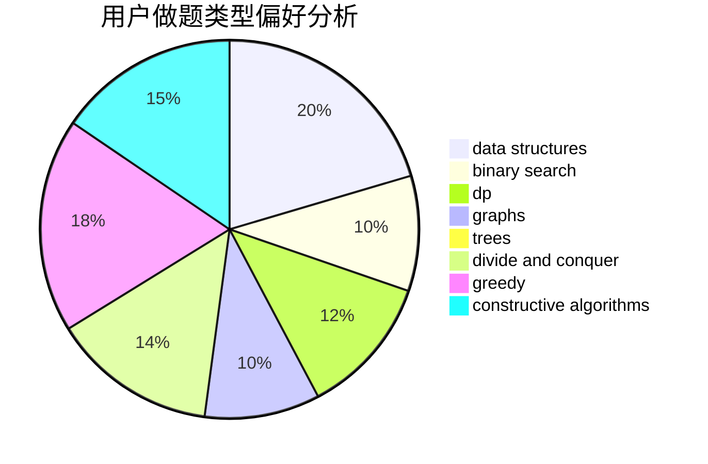
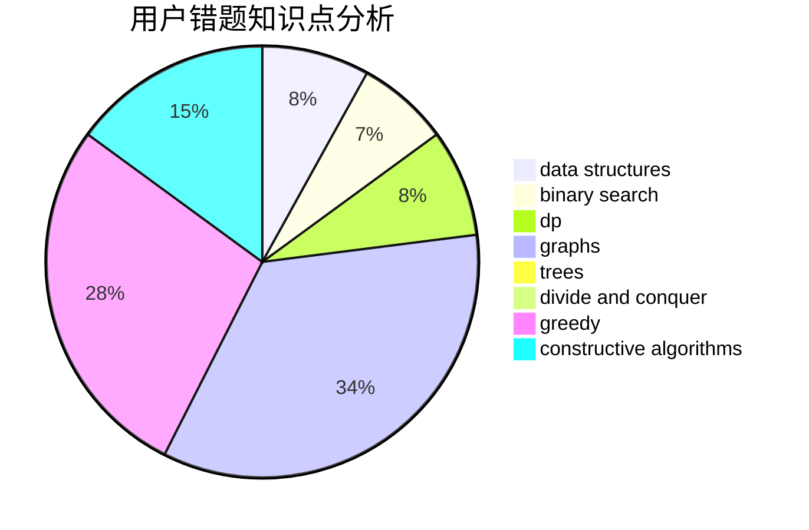

# hnust_tanhua

<!-- tabs:start -->

#### **用户提交结果分析**

#### **用户做题类型偏好分析**

#### **用户错题知识点分析**

<!-- tabs:end -->
# 推荐题目
[962D](https://codeforces.com/contest/962/problem/D)		data structures,
                        implementation		  
[1310B](https://codeforces.com/contest/1310/problem/B)		dp,
                        implementation		  
[913A](https://codeforces.com/contest/913/problem/A)		implementation,
                        math		  
[1065B](https://codeforces.com/contest/1065/problem/B)		constructive algorithms,
                        graphs		  
[343A](https://codeforces.com/contest/343/problem/A)		math,
                        number theory		  
[976F](https://codeforces.com/contest/976/problem/F)		flows,
                        graphs		  
[914E](https://codeforces.com/contest/914/problem/E)		bitmasks,
                        data structures,
                        divide and conquer,
                        trees		  
[675E](https://codeforces.com/contest/675/problem/E)		data structures,
                        dp,
                        greedy		  
[998E](https://codeforces.com/contest/998/problem/E)		dsu,graphs,sortings,trees		  
[1161C](https://codeforces.com/contest/1161/problem/C)		dsu,graphs,sortings,trees		  
