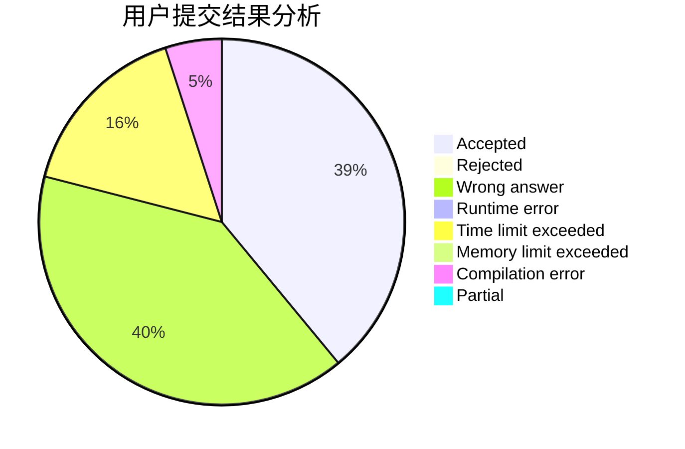
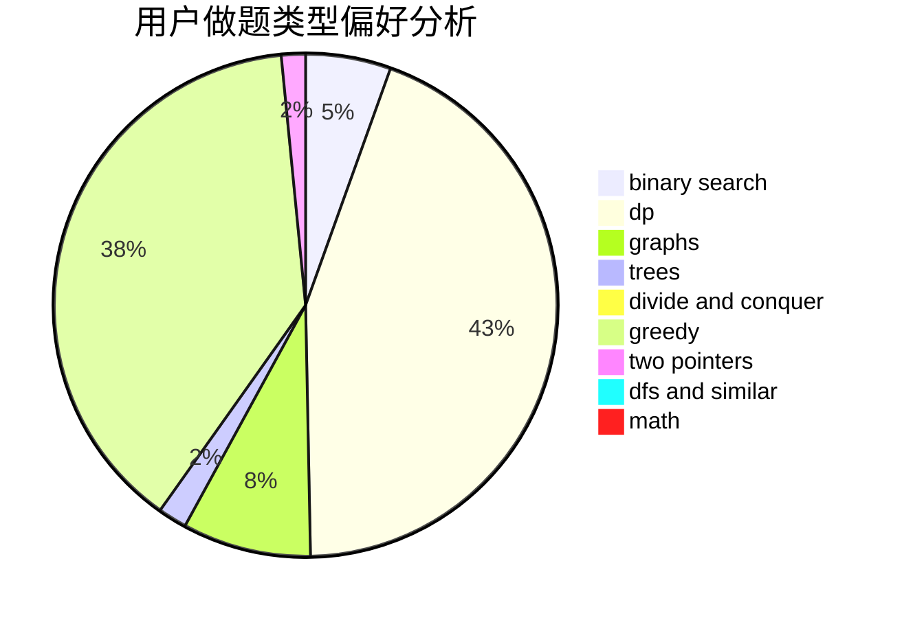

# hnust_tanzhongsheng

<!-- tabs:start -->

#### **用户提交结果分析**

#### **用户做题类型偏好分析**

<!-- tabs:end -->
# 推荐题目
[1023A](https://codeforces.com/contest/1023/problem/A)
[630J](https://codeforces.com/contest/630/problem/J)
[6C](https://codeforces.com/contest/6/problem/C)
[723A](https://codeforces.com/contest/723/problem/A)
[474B](https://codeforces.com/contest/474/problem/B)
[13771](https://codeforces.com/contest/1377/problem/1)
[1312B](https://codeforces.com/contest/1312/problem/B)
[1041C](https://codeforces.com/contest/1041/problem/C)
[1086C](https://codeforces.com/contest/1086/problem/C)
[501A](https://codeforces.com/contest/501/problem/A)
