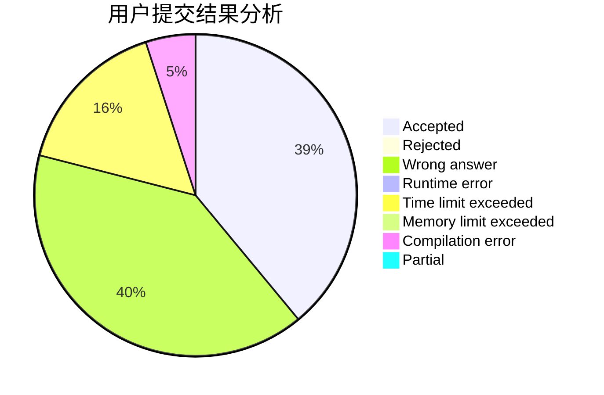
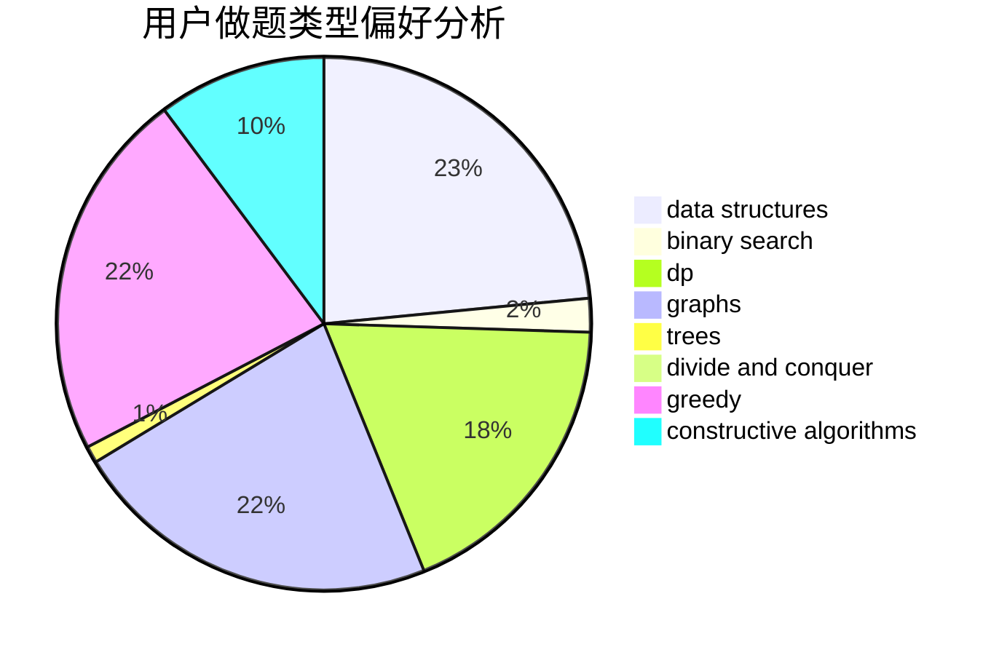

# hnust_tanzhongsheng

<!-- tabs:start -->

#### **用户提交结果分析**

#### **用户做题类型偏好分析**

#### **用户错题知识点分析**

<!-- tabs:end -->
# 推荐题目
[1023A](https://codeforces.com/contest/1023/problem/A)		brute force,
                        implementation,
                        strings		  
[630J](https://codeforces.com/contest/630/problem/J)		math,
                        number theory		  
[6C](https://codeforces.com/contest/6/problem/C)		greedy,
                        two pointers		  
[723A](https://codeforces.com/contest/723/problem/A)		implementation,
                        math,
                        sortings		  
[474B](https://codeforces.com/contest/474/problem/B)		binary search,
                        implementation		  
[13771](https://codeforces.com/contest/1377/problem/1)		dsu,graphs,sortings,trees		  
[1312B](https://codeforces.com/contest/1312/problem/B)		constructive algorithms,
                        sortings		  
[1041C](https://codeforces.com/contest/1041/problem/C)		binary search,
                        data structures,
                        greedy,
                        two pointers		  
[1086C](https://codeforces.com/contest/1086/problem/C)		dsu,graphs,sortings,trees		  
[501A](https://codeforces.com/contest/501/problem/A)		implementation		  
