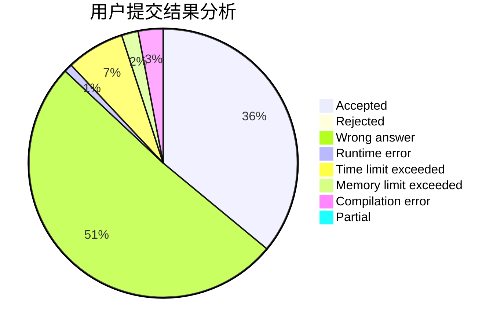
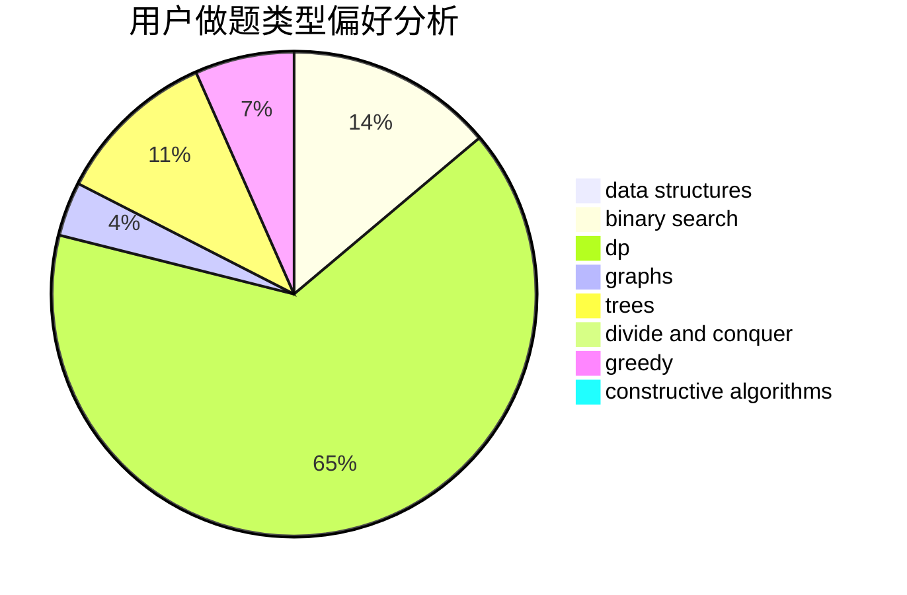

# hnust_yanglei

<!-- tabs:start -->

#### **用户提交结果分析**

#### **用户做题类型偏好分析**

#### **用户错题知识点分析**

<!-- tabs:end -->
# 推荐题目
[1065C](https://codeforces.com/contest/1065/problem/C)		greedy		  
[289D](https://codeforces.com/contest/289/problem/D)		dsu,graphs,sortings,trees		  
[1335E2](https://codeforces.com/contest/1335E/problem/2)		brute force,
                        data structures,
                        dp,
                        two pointers		  
[979A](https://codeforces.com/contest/979/problem/A)		math		  
[913F](https://codeforces.com/contest/913/problem/F)		dp,
                        graphs,
                        math,
                        probabilities		  
[815D](https://codeforces.com/contest/815/problem/D)		binary search,
                        combinatorics,
                        data structures,
                        geometry		  
[73B](https://codeforces.com/contest/73/problem/B)		binary search,
                        greedy,
                        sortings		  
[1276C](https://codeforces.com/contest/1276/problem/C)		brute force,
                        combinatorics,
                        constructive algorithms,
                        data structures,
                        greedy,
                        math		  
[1490A](https://codeforces.com/contest/1490/problem/A)		greedy,
                        math		  
[1496C](https://codeforces.com/contest/1496/problem/C)		dsu,graphs,sortings,trees		  
