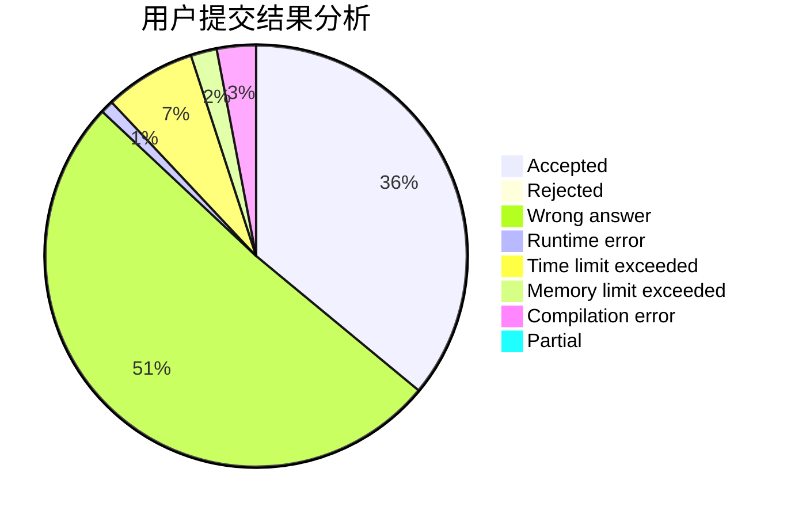
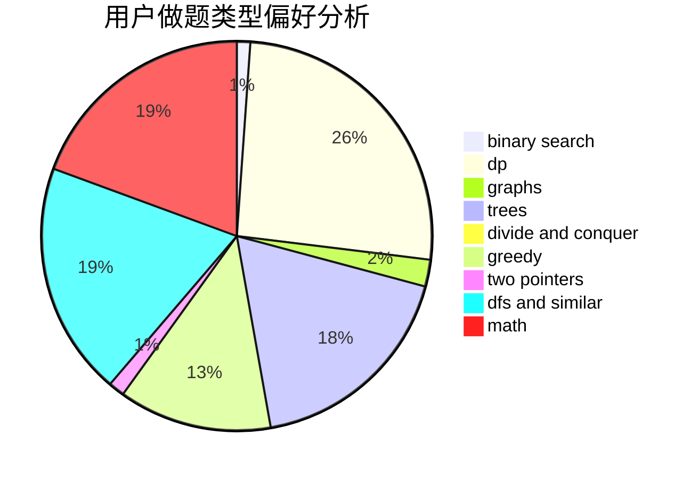

# hnust_yanglei

<!-- tabs:start -->

#### **用户提交结果分析**

#### **用户做题类型偏好分析**

<!-- tabs:end -->
# 推荐题目
[1065G](https://codeforces.com/contest/1065/problem/G)
[303C](https://codeforces.com/contest/303/problem/C)
[1342F](https://codeforces.com/contest/1342/problem/F)
[993A](https://codeforces.com/contest/993/problem/A)
[932D](https://codeforces.com/contest/932/problem/D)
[834D](https://codeforces.com/contest/834/problem/D)
[760B](https://codeforces.com/contest/760/problem/B)
[1282D](https://codeforces.com/contest/1282/problem/D)
[1498F](https://codeforces.com/contest/1498/problem/F)
[1505C](https://codeforces.com/contest/1505/problem/C)
