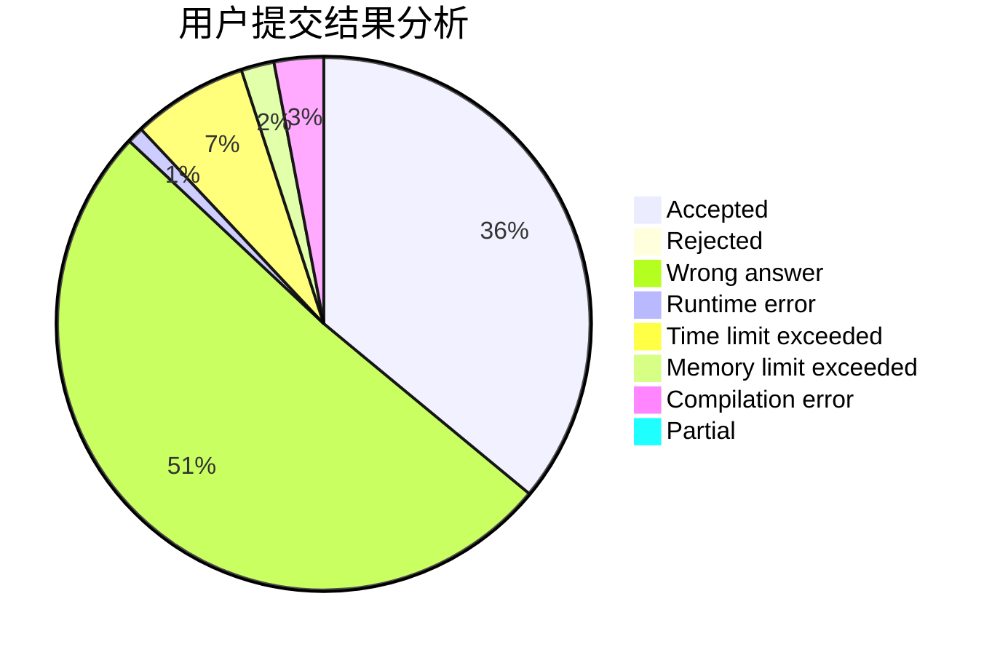
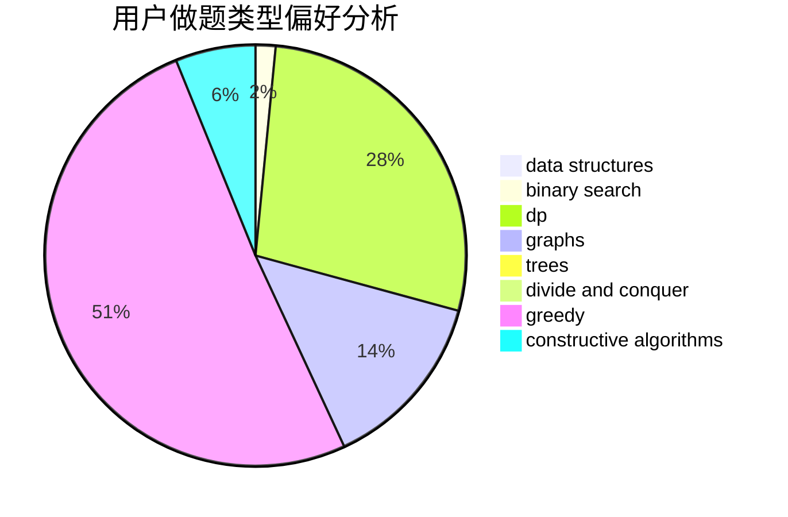

# hnust_yanglei

<!-- tabs:start -->

#### **用户提交结果分析**

#### **用户做题类型偏好分析**

#### **用户错题知识点分析**

<!-- tabs:end -->
# 推荐题目
[1065G](https://codeforces.com/contest/1065/problem/G)		strings		  
[303C](https://codeforces.com/contest/303/problem/C)		brute force,
                        graphs,
                        math,
                        number theory		  
[1342F](https://codeforces.com/contest/1342/problem/F)		bitmasks,
                        brute force,
                        dp		  
[993A](https://codeforces.com/contest/993/problem/A)		geometry,
                        implementation		  
[932D](https://codeforces.com/contest/932/problem/D)		binary search,
                        dp,
                        trees		  
[834D](https://codeforces.com/contest/834/problem/D)		dsu,graphs,sortings,trees		  
[760B](https://codeforces.com/contest/760/problem/B)		binary search,
                        greedy		  
[1282D](https://codeforces.com/contest/1282/problem/D)		constructive algorithms,
                        interactive,
                        strings		  
[1498F](https://codeforces.com/contest/1498/problem/F)		bitmasks,
                        data structures,
                        dfs and similar,
                        dp,
                        games,
                        math,
                        trees		  
[1505C](https://codeforces.com/contest/1505/problem/C)		implementation		  
