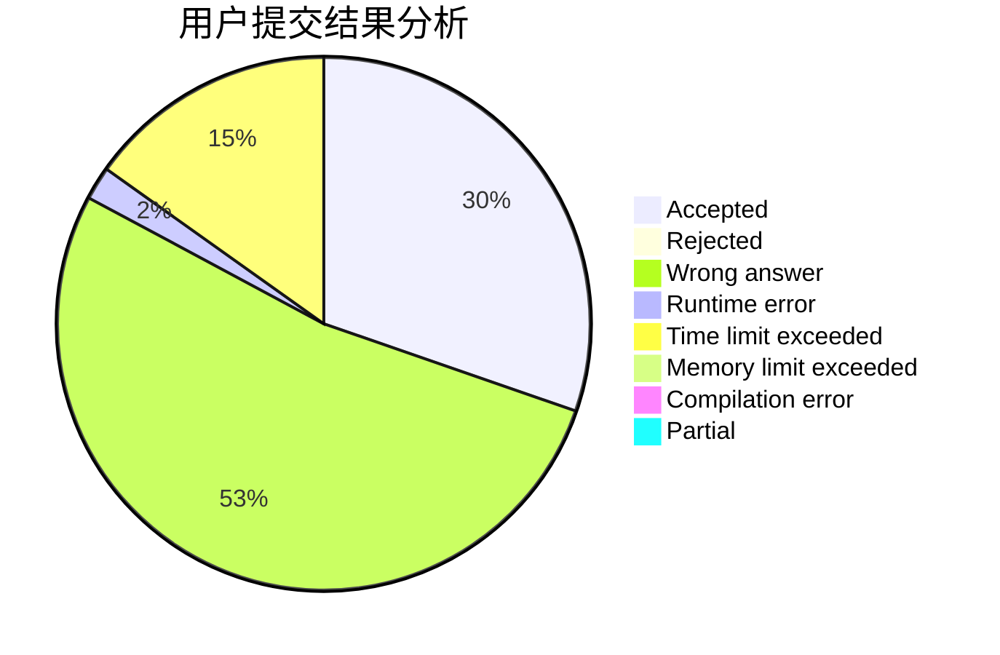
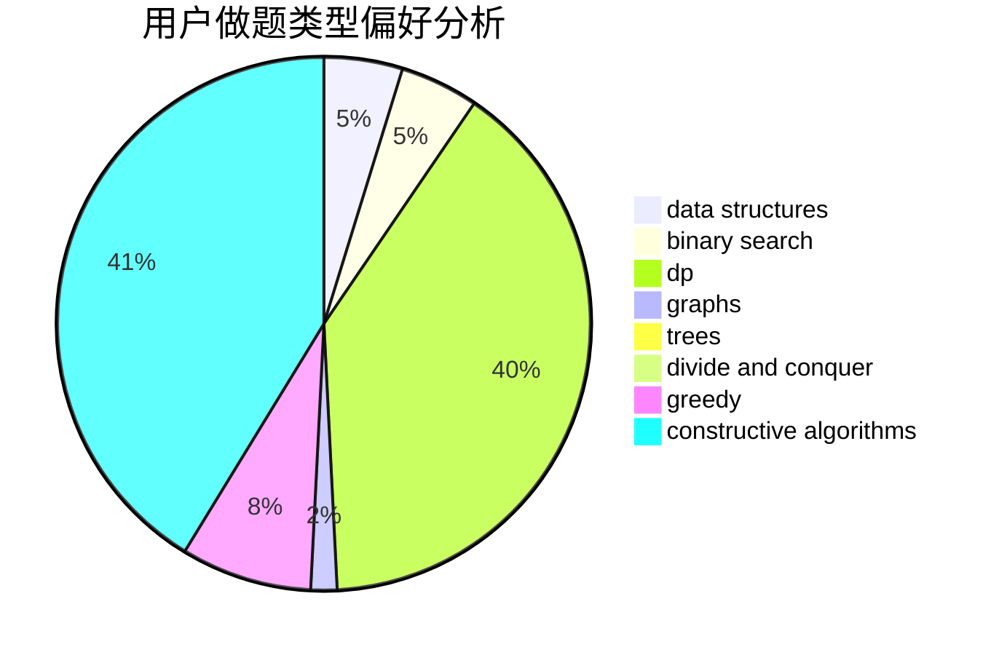

# hnust_yangyanjun

<!-- tabs:start -->

#### **用户提交结果分析**

#### **用户做题类型偏好分析**

#### **用户错题知识点分析**

<!-- tabs:end -->
# 推荐题目
[931F](https://codeforces.com/contest/931/problem/F)		dsu,graphs,sortings,trees		  
[580A](https://codeforces.com/contest/580/problem/A)		brute force,
                        dp,
                        implementation		  
[1349C](https://codeforces.com/contest/1349/problem/C)		dfs and similar,
                        graphs,
                        implementation,
                        shortest paths		  
[546D](https://codeforces.com/contest/546/problem/D)		constructive algorithms,
                        dp,
                        math,
                        number theory		  
[1161E](https://codeforces.com/contest/1161/problem/E)		dsu,graphs,sortings,trees		  
[883B](https://codeforces.com/contest/883/problem/B)		constructive algorithms,
                        graphs,
                        greedy		  
[662A](https://codeforces.com/contest/662/problem/A)		bitmasks,
                        math,
                        matrices,
                        probabilities		  
[241B](https://codeforces.com/contest/241/problem/B)		binary search,
                        bitmasks,
                        data structures,
                        math		  
[1229C](https://codeforces.com/contest/1229/problem/C)		dsu,graphs,sortings,trees		  
[1255C](https://codeforces.com/contest/1255/problem/C)		constructive algorithms,
                        implementation		  
