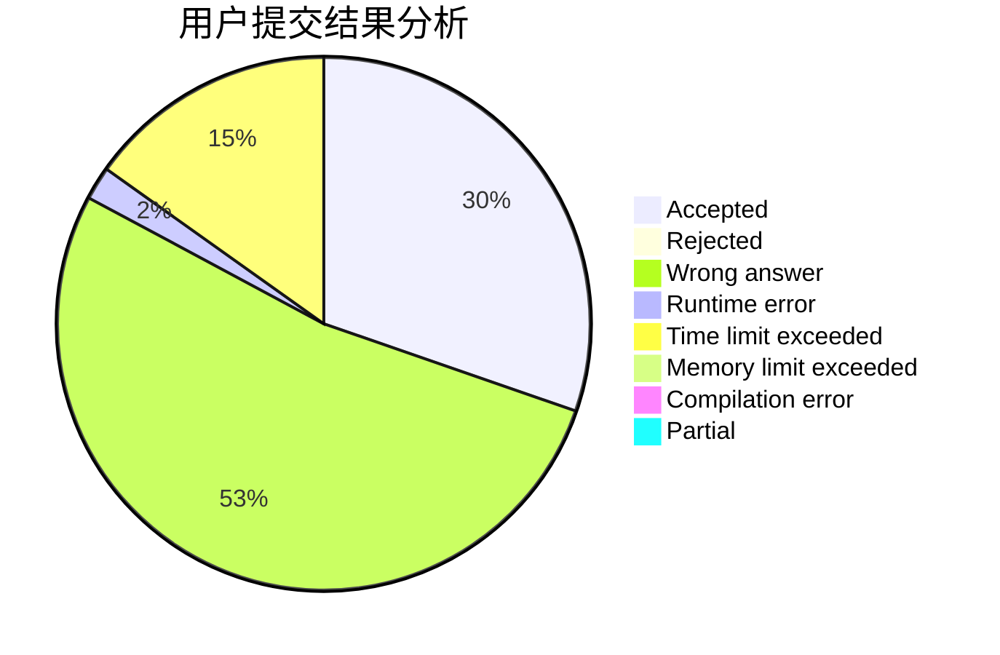
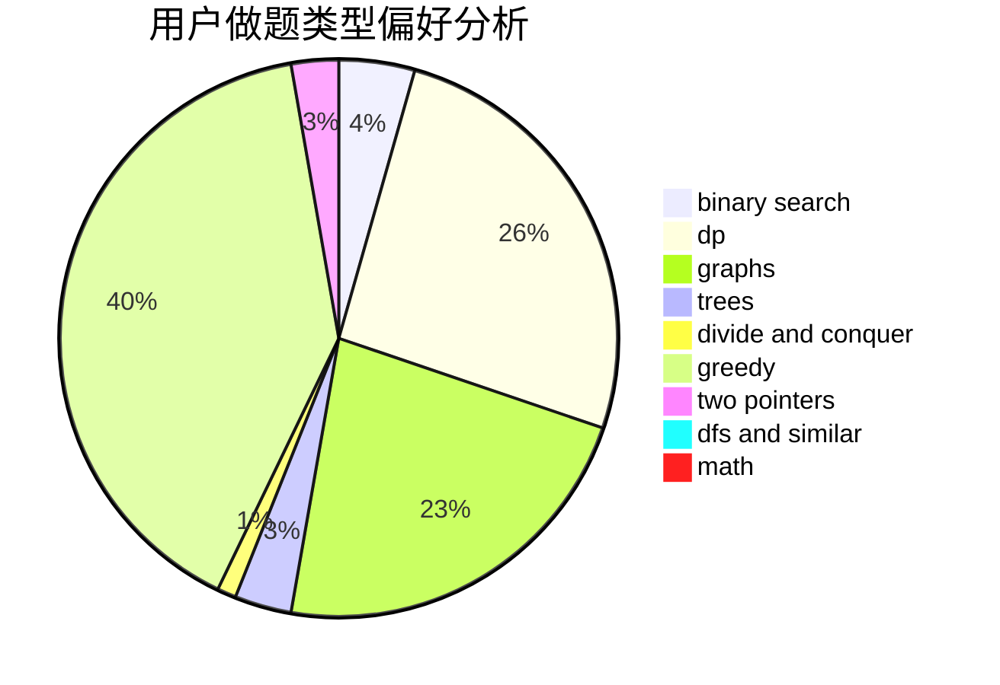

# hnust_yangyanjun

<!-- tabs:start -->

#### **用户提交结果分析**

#### **用户做题类型偏好分析**

<!-- tabs:end -->
# 推荐题目
[952E](https://codeforces.com/contest/952/problem/E)
[600C](https://codeforces.com/contest/600/problem/C)
[13561](https://codeforces.com/contest/1356/problem/1)
[570E](https://codeforces.com/contest/570/problem/E)
[1164G](https://codeforces.com/contest/1164/problem/G)
[900A](https://codeforces.com/contest/900/problem/A)
[682A](https://codeforces.com/contest/682/problem/A)
[261E](https://codeforces.com/contest/261/problem/E)
[1237G](https://codeforces.com/contest/1237/problem/G)
[1262C](https://codeforces.com/contest/1262/problem/C)
