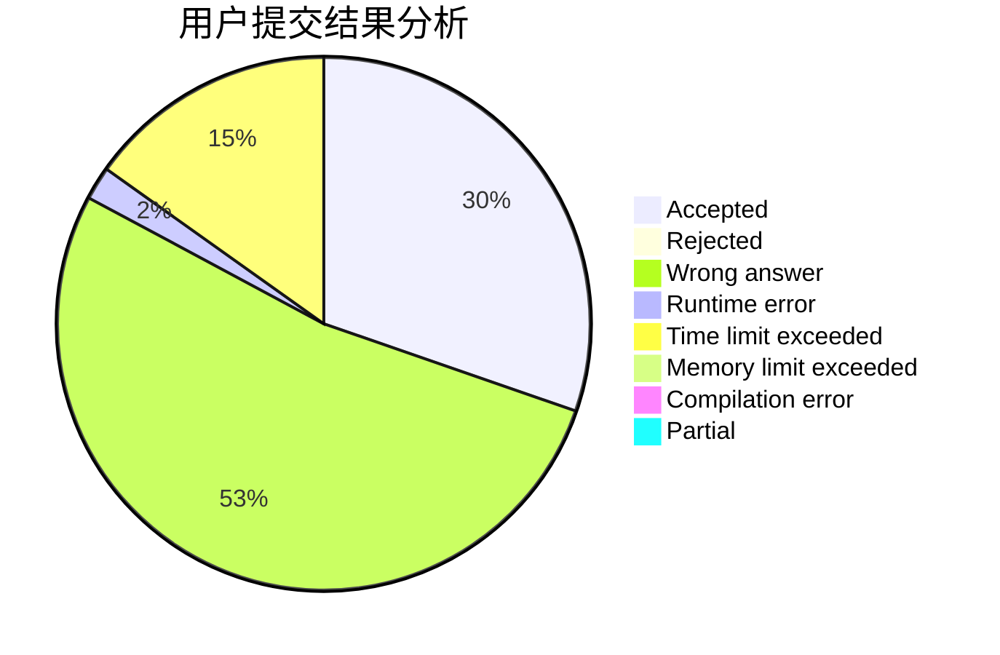
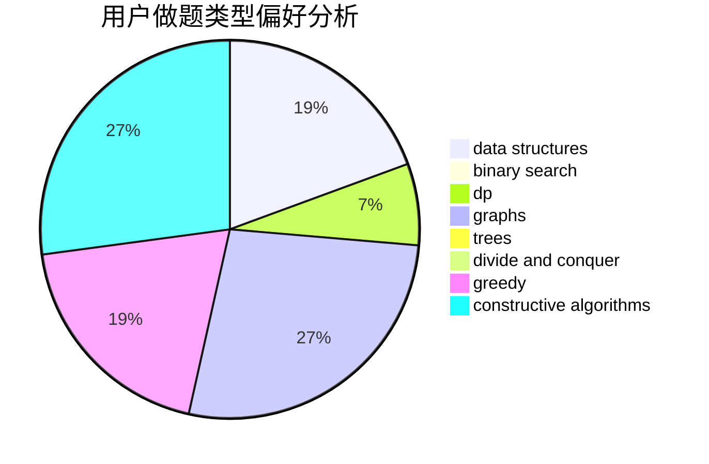

# hnust_yangyanjun

<!-- tabs:start -->

#### **用户提交结果分析**

#### **用户做题类型偏好分析**

#### **用户错题知识点分析**

<!-- tabs:end -->
# 推荐题目
[952E](https://codeforces.com/contest/952/problem/E)		nan		  
[600C](https://codeforces.com/contest/600/problem/C)		constructive algorithms,
                        greedy,
                        strings		  
[13561](https://codeforces.com/contest/1356/problem/1)		dsu,graphs,sortings,trees		  
[570E](https://codeforces.com/contest/570/problem/E)		combinatorics,
                        dp		  
[1164G](https://codeforces.com/contest/1164/problem/G)		dsu,graphs,sortings,trees		  
[900A](https://codeforces.com/contest/900/problem/A)		geometry,
                        implementation		  
[682A](https://codeforces.com/contest/682/problem/A)		constructive algorithms,
                        math,
                        number theory		  
[261E](https://codeforces.com/contest/261/problem/E)		brute force,
                        dp,
                        two pointers		  
[1237G](https://codeforces.com/contest/1237/problem/G)		data structures,
                        dp,
                        greedy		  
[1262C](https://codeforces.com/contest/1262/problem/C)		dsu,graphs,sortings,trees		  
