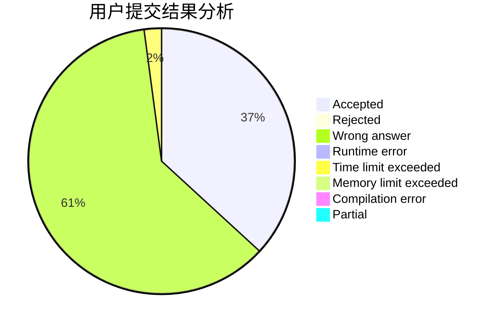
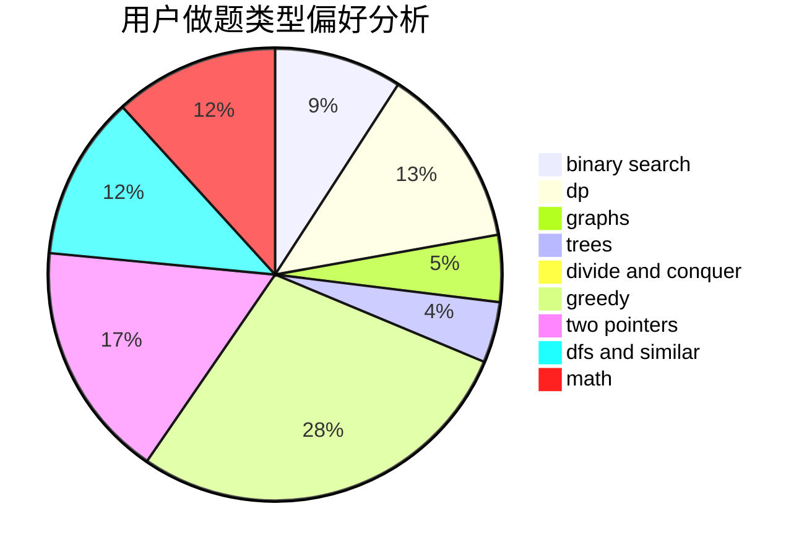

# hnust_zengwei1

<!-- tabs:start -->

#### **用户提交结果分析**

#### **用户做题类型偏好分析**

<!-- tabs:end -->
# 推荐题目
[381B](https://codeforces.com/contest/381/problem/B)
[1023A](https://codeforces.com/contest/1023/problem/A)
[498A](https://codeforces.com/contest/498/problem/A)
[819B](https://codeforces.com/contest/819/problem/B)
[1256F](https://codeforces.com/contest/1256/problem/F)
[748C](https://codeforces.com/contest/748/problem/C)
[56B](https://codeforces.com/contest/56/problem/B)
[404C](https://codeforces.com/contest/404/problem/C)
[1385F](https://codeforces.com/contest/1385/problem/F)
[1202D](https://codeforces.com/contest/1202/problem/D)
