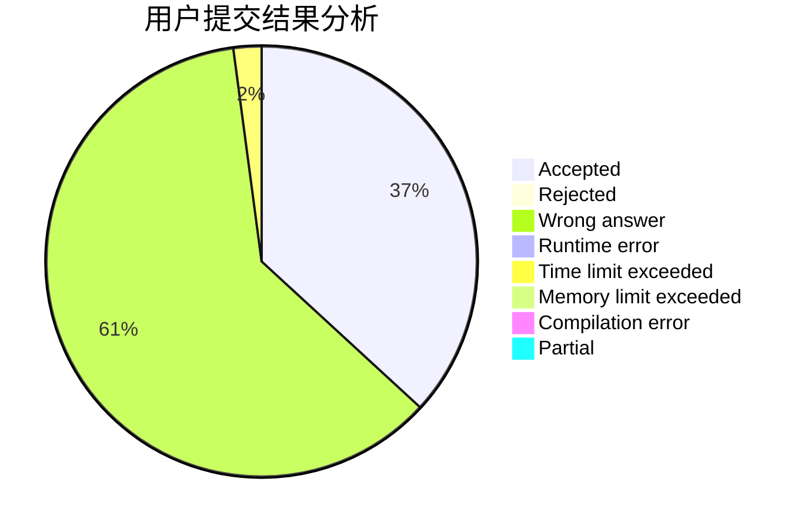
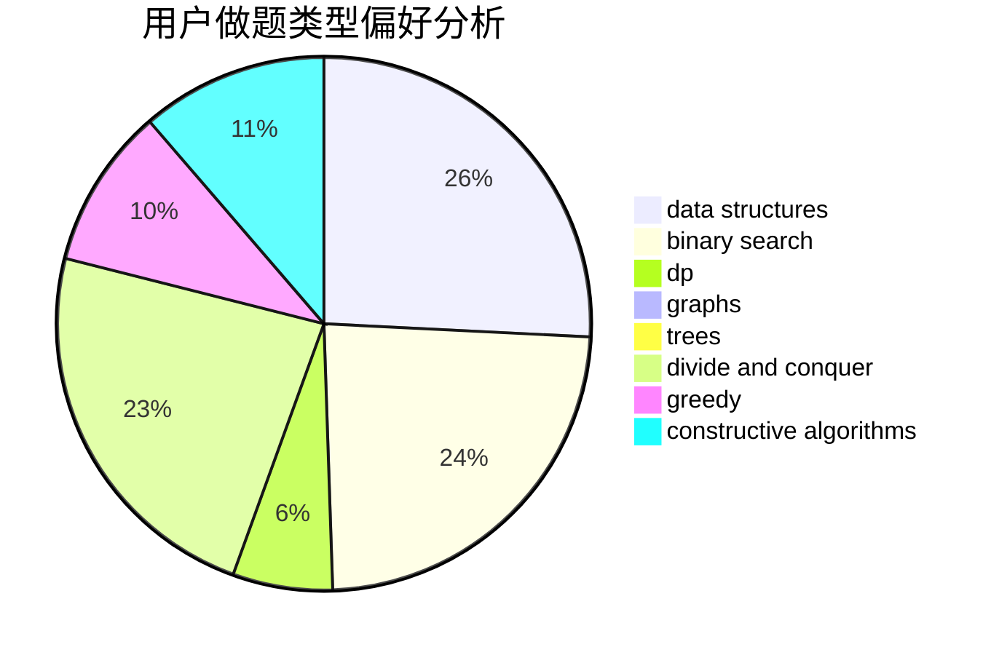
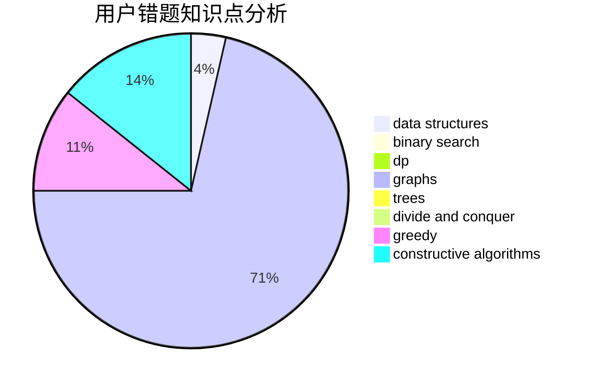

# hnust_zengwei1

<!-- tabs:start -->

#### **用户提交结果分析**

#### **用户做题类型偏好分析**

#### **用户错题知识点分析**

<!-- tabs:end -->
# 推荐题目
[356C](https://codeforces.com/contest/356/problem/C)		combinatorics,
                        constructive algorithms,
                        greedy,
                        implementation		  
[1020C](https://codeforces.com/contest/1020/problem/C)		dsu,graphs,sortings,trees		  
[478A](https://codeforces.com/contest/478/problem/A)		implementation		  
[803D](https://codeforces.com/contest/803/problem/D)		binary search,
                        greedy		  
[1251E1](https://codeforces.com/contest/1251E/problem/1)		data structures,
                        dp,
                        greedy		  
[730H](https://codeforces.com/contest/730/problem/H)		constructive algorithms,
                        implementation		  
[545B](https://codeforces.com/contest/545/problem/B)		greedy		  
[376A](https://codeforces.com/contest/376/problem/A)		implementation,
                        math		  
[1376B2](https://codeforces.com/contest/1376B/problem/2)		dsu,graphs,sortings,trees		  
[1198F](https://codeforces.com/contest/1198/problem/F)		greedy,
                        number theory,
                        probabilities		  
