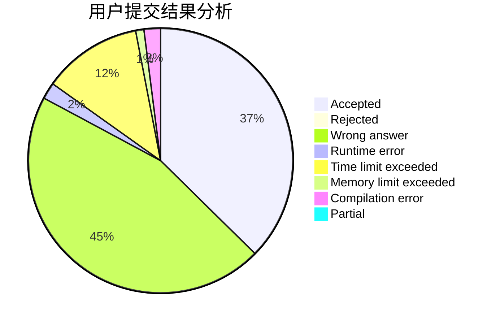
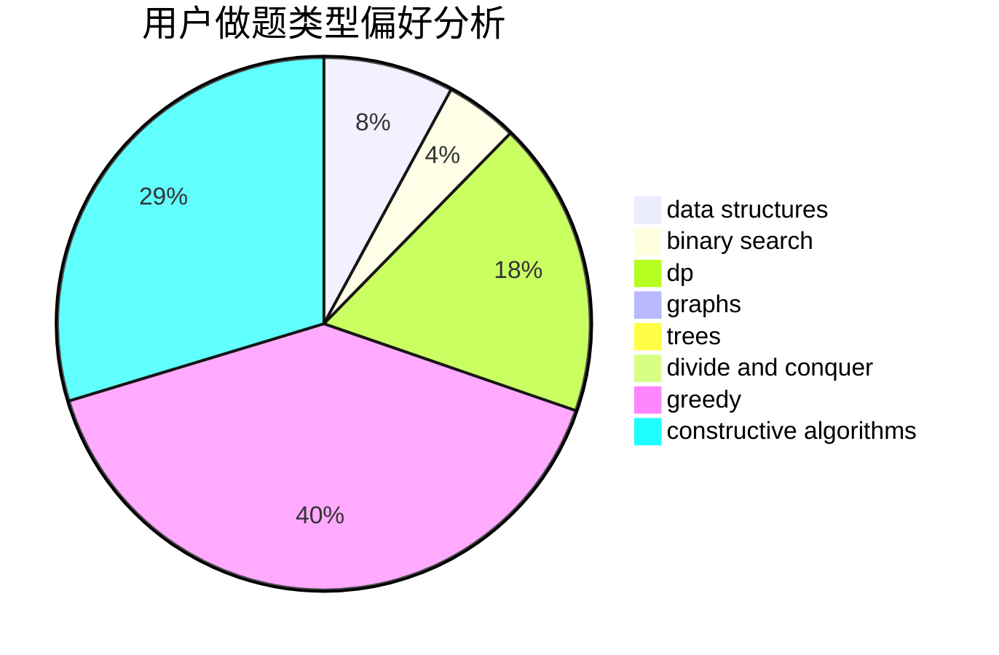
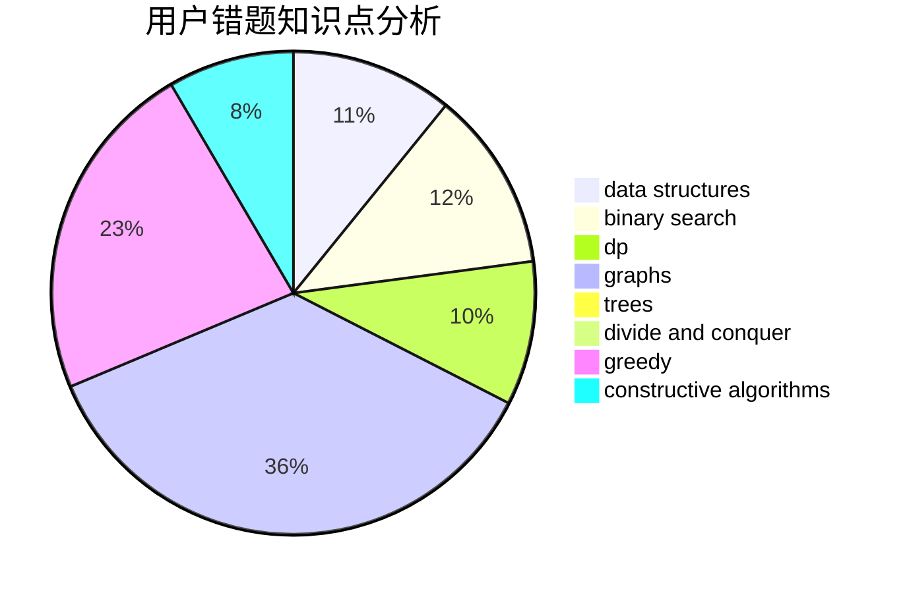

# hnust_zhangpeng

<!-- tabs:start -->

#### **用户提交结果分析**

#### **用户做题类型偏好分析**

#### **用户错题知识点分析**

<!-- tabs:end -->
# 推荐题目
[1496C](https://codeforces.com/contest/1496/problem/C)		dsu,graphs,sortings,trees		  
[1415F](https://codeforces.com/contest/1415/problem/F)		dp		  
[505A](https://codeforces.com/contest/505/problem/A)		brute force,
                        implementation,
                        strings		  
[1399F](https://codeforces.com/contest/1399/problem/F)		data structures,
                        dp,
                        graphs,
                        sortings		  
[558A](https://codeforces.com/contest/558/problem/A)		brute force,
                        implementation,
                        sortings		  
[108C](https://codeforces.com/contest/108/problem/C)		dsu,graphs,sortings,trees		  
[524E](https://codeforces.com/contest/524/problem/E)		data structures,
                        sortings		  
[268A](https://codeforces.com/contest/268/problem/A)		brute force		  
[178F3](https://codeforces.com/contest/178F/problem/3)		nan		  
[1271E](https://codeforces.com/contest/1271/problem/E)		binary search,
                        combinatorics,
                        dp,
                        math		  
