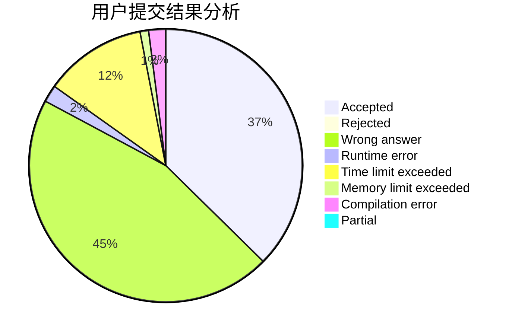
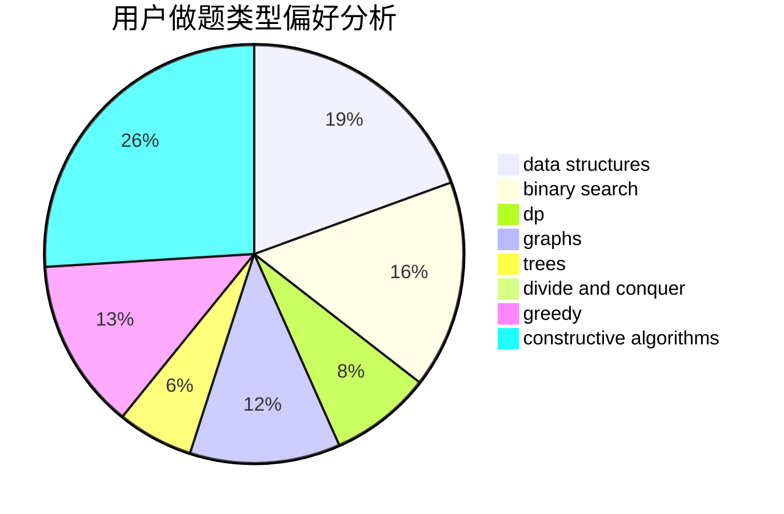
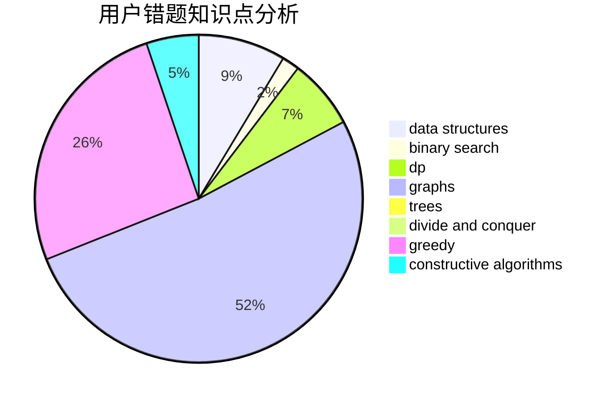

# hnust_zhangpeng

<!-- tabs:start -->

#### **用户提交结果分析**

#### **用户做题类型偏好分析**

#### **用户错题知识点分析**

<!-- tabs:end -->
# 推荐题目
[1505C](https://codeforces.com/contest/1505/problem/C)		implementation		  
[1423J](https://codeforces.com/contest/1423/problem/J)		bitmasks,
                        constructive algorithms,
                        dp,
                        math		  
[525C](https://codeforces.com/contest/525/problem/C)		greedy,
                        math,
                        sortings		  
[1408H](https://codeforces.com/contest/1408/problem/H)		binary search,
                        data structures,
                        flows,
                        greedy		  
[581A](https://codeforces.com/contest/581/problem/A)		implementation,
                        math		  
[1090D](https://codeforces.com/contest/1090/problem/D)		constructive algorithms		  
[549B](https://codeforces.com/contest/549/problem/B)		constructive algorithms,
                        dfs and similar,
                        graphs,
                        greedy		  
[283B](https://codeforces.com/contest/283/problem/B)		dfs and similar,
                        dp,
                        graphs		  
[205A](https://codeforces.com/contest/205/problem/A)		brute force,
                        implementation		  
[1281A](https://codeforces.com/contest/1281/problem/A)		implementation		  
