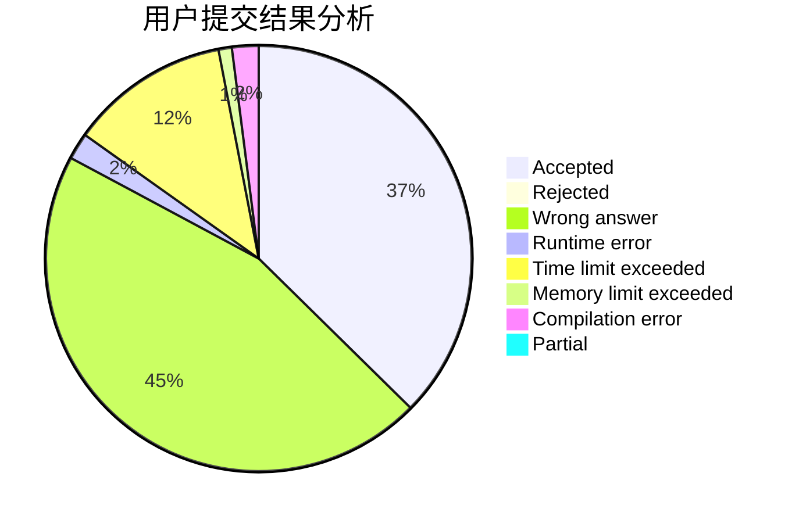
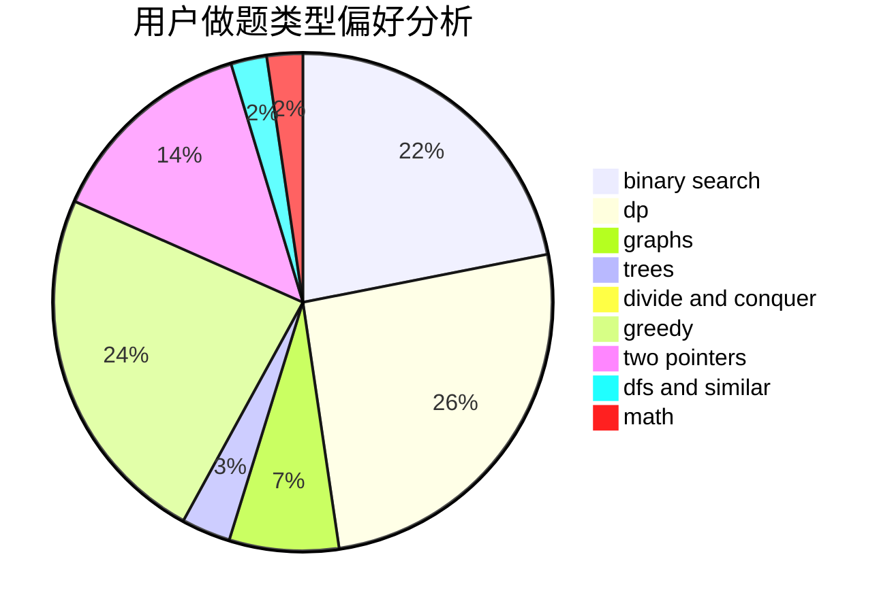

# hnust_zhangpeng

<!-- tabs:start -->

#### **用户提交结果分析**

#### **用户做题类型偏好分析**

<!-- tabs:end -->
# 推荐题目
[1505C](https://codeforces.com/contest/1505/problem/C)
[1423J](https://codeforces.com/contest/1423/problem/J)
[525C](https://codeforces.com/contest/525/problem/C)
[1408H](https://codeforces.com/contest/1408/problem/H)
[581A](https://codeforces.com/contest/581/problem/A)
[1090D](https://codeforces.com/contest/1090/problem/D)
[549B](https://codeforces.com/contest/549/problem/B)
[283B](https://codeforces.com/contest/283/problem/B)
[205A](https://codeforces.com/contest/205/problem/A)
[1281A](https://codeforces.com/contest/1281/problem/A)
