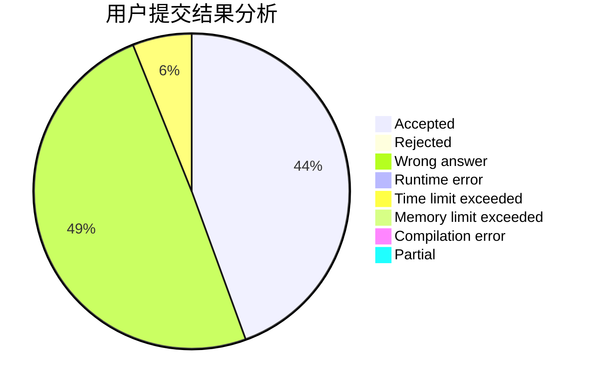
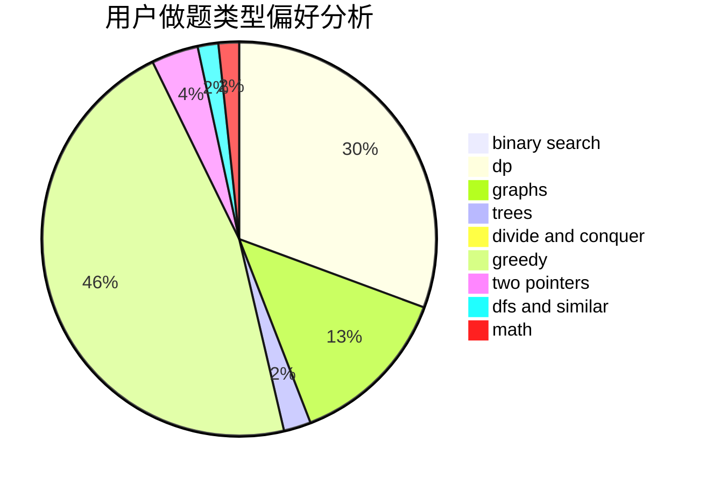

# hnust_zhoubang

<!-- tabs:start -->

#### **用户提交结果分析**

#### **用户做题类型偏好分析**

<!-- tabs:end -->
# 推荐题目
[543E](https://codeforces.com/contest/543/problem/E)
[13681](https://codeforces.com/contest/1368/problem/1)
[665C](https://codeforces.com/contest/665/problem/C)
[750F](https://codeforces.com/contest/750/problem/F)
[631B](https://codeforces.com/contest/631/problem/B)
[362C](https://codeforces.com/contest/362/problem/C)
[540C](https://codeforces.com/contest/540/problem/C)
[617B](https://codeforces.com/contest/617/problem/B)
[1078D](https://codeforces.com/contest/1078/problem/D)
[523A](https://codeforces.com/contest/523/problem/A)
