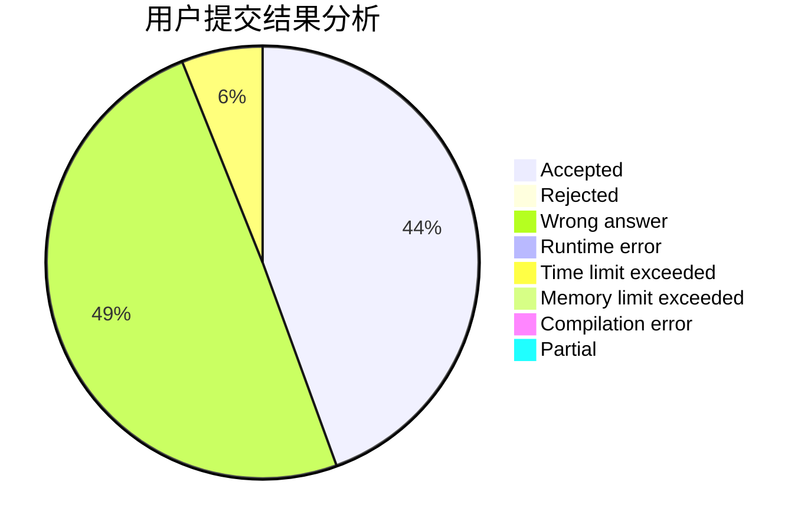
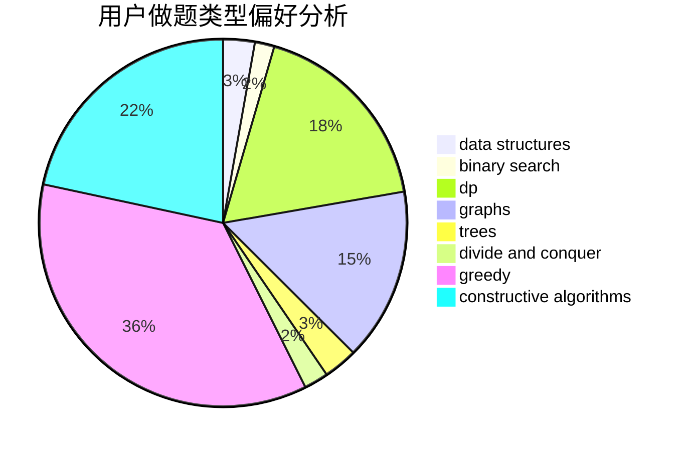

# hnust_zhoubang
<!-- tabs:start -->
#### **用户提交结果分析**

#### **用户做题类型偏好分析**

#### **用户错题知识点分析**

<!-- tabs:end -->
# 推荐题目
[Drazil and His Happy Friends](http://codeforces.com/problemset/problem/516/E)		math,
                        number theory		  
[Rectangle and Square](http://codeforces.com/problemset/problem/135/B)		brute force,
                        geometry,
                        math		  
[Ebony and Ivory](http://codeforces.com/problemset/problem/633/A)		brute force,
                        math,
                        number theory		  
[Grasshopper And the String](http://codeforces.com/problemset/problem/733/A)		implementation		  
[Rectangles and Square](http://codeforces.com/problemset/problem/335/D)		brute force,
                        dp		  
[Missile Silos](http://codeforces.com/problemset/problem/144/D)		data structures,
                        dfs and similar,
                        graphs,
                        shortest paths		  
[Rooks and Rectangles](http://codeforces.com/problemset/problem/524/E)		data structures,
                        sortings		  
[Xor-tree](https://codeforces.com/contest/430/problem/C)		dfs and similar,
                        trees		  
[The Text Splitting](http://codeforces.com/problemset/problem/612/A)		brute force,
                        implementation,
                        strings		  
[Increase and Decrease](http://codeforces.com/problemset/problem/246/B)		greedy,
                        math		  
<!-- tabs:start -->
#### **data structures**
[Drazil and His Happy Friends](http://codeforces.com/problemset/problem/144/D)		data structures,
                        dfs and similar,
                        graphs,
                        shortest paths		  
[Rectangle and Square](http://codeforces.com/problemset/problem/524/E)		data structures,
                        sortings		  
[Ebony and Ivory](https://codeforces.com/contest/281/problem/D)		data structures,
                        implementation,
                        two pointers		  
[Grasshopper And the String](http://codeforces.com/problemset/problem/144/E)		data structures,
                        greedy		  
[Rectangles and Square](http://codeforces.com/problemset/problem/982/B)		data structures,
                        greedy,
                        implementation		  
[Missile Silos](http://codeforces.com/problemset/problem/1092/D2)		data structures,
                        implementation		  
[Rooks and Rectangles](https://codeforces.com/contest/1180/problem/C)		data structures,
                        implementation		  
[Xor-tree](http://codeforces.com/problemset/problem/342/E)		data structures,
                        divide and conquer,
                        trees		  
[The Text Splitting](http://codeforces.com/problemset/problem/418/D)		data structures,
                        graphs,
                        trees		  
[Increase and Decrease](http://codeforces.com/problemset/problem/1182/F)		binary search,
                        data structures,
                        number theory		  
#### **binary search**
[Drazil and His Happy Friends](http://codeforces.com/problemset/problem/1182/F)		binary search,
                        data structures,
                        number theory		  
[Rectangle and Square](http://codeforces.com/problemset/problem/889/E)		binary search,
                        dp,
                        math		  
[Ebony and Ivory](http://codeforces.com/problemset/problem/1201/C)		binary search,
                        greedy,
                        math,
                        sortings		  
[Grasshopper And the String](http://codeforces.com/problemset/problem/1492/C)		binary search,
                        data structures,
                        dp,
                        greedy,
                        two pointers		  
[Rectangles and Square](http://codeforces.com/problemset/problem/1463/D)		binary search,
                        constructive algorithms,
                        greedy,
                        two pointers		  
[Missile Silos](http://codeforces.com/problemset/problem/1490/G)		binary search,
                        data structures,
                        math		  
[Rooks and Rectangles](http://codeforces.com/problemset/problem/1479/D)		binary search,
                        bitmasks,
                        brute force,
                        data structures,
                        probabilities,
                        trees		  
[Xor-tree](http://codeforces.com/problemset/problem/1436/E)		binary search,
                        data structures,
                        two pointers		  
[The Text Splitting](http://codeforces.com/problemset/problem/1461/D)		binary search,
                        brute force,
                        data structures,
                        divide and conquer,
                        implementation,
                        sortings		  
[Increase and Decrease](http://codeforces.com/problemset/problem/1493/C)		binary search,
                        brute force,
                        constructive algorithms,
                        greedy,
                        strings		  
#### **dp**
[Drazil and His Happy Friends](http://codeforces.com/problemset/problem/335/D)		brute force,
                        dp		  
[Rectangle and Square](http://codeforces.com/problemset/problem/1163/D)		dp,
                        strings		  
[Ebony and Ivory](http://codeforces.com/problemset/problem/1463/F)		bitmasks,
                        dp,
                        math		  
[Grasshopper And the String](http://codeforces.com/problemset/problem/514/E)		dp,
                        matrices		  
[Rectangles and Square](http://codeforces.com/problemset/problem/303/E)		dp,
                        math,
                        probabilities		  
[Missile Silos](http://codeforces.com/problemset/problem/1499/F)		combinatorics,
                        dfs and similar,
                        dp,
                        trees		  
[Rooks and Rectangles](https://codeforces.com/contest/1277/problem/C)		dp,
                        greedy		  
[Xor-tree](http://codeforces.com/problemset/problem/1089/A)		dp		  
[The Text Splitting](http://codeforces.com/problemset/problem/1467/D)		combinatorics,
                        dp,
                        math		  
[Increase and Decrease](http://codeforces.com/problemset/problem/1497/D)		bitmasks,
                        dp,
                        graphs,
                        number theory		  
#### **graph**
[Drazil and His Happy Friends](http://codeforces.com/problemset/problem/144/D)		data structures,
                        dfs and similar,
                        graphs,
                        shortest paths		  
[Rectangle and Square](http://codeforces.com/problemset/problem/418/D)		data structures,
                        graphs,
                        trees		  
[Ebony and Ivory](http://codeforces.com/problemset/problem/1497/D)		bitmasks,
                        dp,
                        graphs,
                        number theory		  
[Grasshopper And the String](http://codeforces.com/problemset/problem/1487/C)		brute force,
                        constructive algorithms,
                        dfs and similar,
                        graphs,
                        greedy,
                        implementation,
                        math		  
[Rectangles and Square](http://codeforces.com/problemset/problem/1437/C)		dp,
                        flows,
                        graph matchings,
                        greedy,
                        math,
                        sortings		  
[Missile Silos](http://codeforces.com/problemset/problem/1470/D)		constructive algorithms,
                        dfs and similar,
                        graph matchings,
                        graphs,
                        greedy		  
[Rooks and Rectangles](http://codeforces.com/problemset/problem/1476/C)		dp,
                        graphs,
                        greedy		  
[Xor-tree](http://codeforces.com/problemset/problem/1304/D)		constructive algorithms,
                        graphs,
                        greedy,
                        two pointers		  
[The Text Splitting](http://codeforces.com/problemset/problem/1475/C)		combinatorics,
                        graphs,
                        math		  
[Increase and Decrease](http://codeforces.com/problemset/problem/553/E)		dp,
                        fft,
                        graphs,
                        math,
                        probabilities		  
#### **trees**
[Drazil and His Happy Friends](https://codeforces.com/contest/430/problem/C)		dfs and similar,
                        trees		  
[Rectangle and Square](http://codeforces.com/problemset/problem/1044/B)		dfs and similar,
                        interactive,
                        trees		  
[Ebony and Ivory](http://codeforces.com/problemset/problem/1499/F)		combinatorics,
                        dfs and similar,
                        dp,
                        trees		  
[Grasshopper And the String](https://codeforces.com/contest/1189/problem/D1)		trees		  
[Rectangles and Square](http://codeforces.com/problemset/problem/342/E)		data structures,
                        divide and conquer,
                        trees		  
[Missile Silos](http://codeforces.com/problemset/problem/418/D)		data structures,
                        graphs,
                        trees		  
[Rooks and Rectangles](http://codeforces.com/problemset/problem/501/C)		constructive algorithms,
                        data structures,
                        greedy,
                        sortings,
                        trees		  
[Xor-tree](http://codeforces.com/problemset/problem/959/C)		constructive algorithms,
                        trees		  
[The Text Splitting](http://codeforces.com/problemset/problem/620/F)		data structures,
                        strings,
                        trees		  
[Increase and Decrease](http://codeforces.com/problemset/problem/1479/D)		binary search,
                        bitmasks,
                        brute force,
                        data structures,
                        probabilities,
                        trees		  
#### **divide and conquer**
[Drazil and His Happy Friends](http://codeforces.com/problemset/problem/342/E)		data structures,
                        divide and conquer,
                        trees		  
[Rectangle and Square](http://codeforces.com/problemset/problem/1461/D)		binary search,
                        brute force,
                        data structures,
                        divide and conquer,
                        implementation,
                        sortings		  
[Ebony and Ivory](http://codeforces.com/problemset/problem/1466/G)		combinatorics,
                        divide and conquer,
                        hashing,
                        math,
                        string suffix structures,
                        strings		  
[Grasshopper And the String](http://codeforces.com/problemset/problem/1490/D)		dfs and similar,
                        divide and conquer,
                        implementation		  
[Rectangles and Square](https://codeforces.com/contest/1483/problem/C)		data structures,
                        divide and conquer,
                        dp		  
[Missile Silos](http://codeforces.com/problemset/problem/1491/E)		brute force,
                        dfs and similar,
                        divide and conquer,
                        number theory,
                        trees		  
[Rooks and Rectangles](http://codeforces.com/problemset/problem/1303/G)		data structures,
                        divide and conquer,
                        geometry,
                        trees		  
[Xor-tree](http://codeforces.com/problemset/problem/1494/D)		constructive algorithms,
                        data structures,
                        dfs and similar,
                        divide and conquer,
                        dsu,
                        greedy,
                        sortings,
                        trees		  
[The Text Splitting](http://codeforces.com/problemset/problem/1482/E)		data structures,
                        divide and conquer,
                        dp		  
[Increase and Decrease](http://codeforces.com/problemset/problem/566/C)		dfs and similar,
                        divide and conquer,
                        trees		  
#### **greedy**
[Drazil and His Happy Friends](http://codeforces.com/problemset/problem/246/B)		greedy,
                        math		  
[Rectangle and Square](http://codeforces.com/problemset/problem/144/E)		data structures,
                        greedy		  
[Ebony and Ivory](http://codeforces.com/problemset/problem/1157/D)		constructive algorithms,
                        greedy,
                        math		  
[Grasshopper And the String](http://codeforces.com/problemset/problem/1163/A)		greedy,
                        math		  
[Rectangles and Square](http://codeforces.com/problemset/problem/982/B)		data structures,
                        greedy,
                        implementation		  
[Missile Silos](http://codeforces.com/problemset/problem/320/A)		brute force,
                        greedy		  
[Rooks and Rectangles](http://codeforces.com/problemset/problem/1204/B)		greedy,
                        math		  
[Xor-tree](http://codeforces.com/problemset/problem/1107/A)		greedy,
                        strings		  
[The Text Splitting](https://codeforces.com/contest/1277/problem/C)		dp,
                        greedy		  
[Increase and Decrease](http://codeforces.com/problemset/problem/501/C)		constructive algorithms,
                        data structures,
                        greedy,
                        sortings,
                        trees		  
#### **constructive algorithms**
[Drazil and His Happy Friends](http://codeforces.com/problemset/problem/1157/D)		constructive algorithms,
                        greedy,
                        math		  
[Rectangle and Square](http://codeforces.com/problemset/problem/501/C)		constructive algorithms,
                        data structures,
                        greedy,
                        sortings,
                        trees		  
[Ebony and Ivory](http://codeforces.com/problemset/problem/500/C)		constructive algorithms,
                        greedy,
                        implementation,
                        math		  
[Grasshopper And the String](http://codeforces.com/problemset/problem/959/C)		constructive algorithms,
                        trees		  
[Rectangles and Square](http://codeforces.com/problemset/problem/1365/F)		constructive algorithms,
                        implementation,
                        sortings		  
[Missile Silos](http://codeforces.com/problemset/problem/1493/A)		constructive algorithms,
                        greedy		  
[Rooks and Rectangles](http://codeforces.com/problemset/problem/1463/D)		binary search,
                        constructive algorithms,
                        greedy,
                        two pointers		  
[Xor-tree](https://codeforces.com/contest/1456/problem/B)		bitmasks,
                        brute force,
                        constructive algorithms		  
[The Text Splitting](http://codeforces.com/problemset/problem/1492/D)		bitmasks,
                        constructive algorithms,
                        greedy,
                        math		  
[Increase and Decrease](https://codeforces.com/contest/1504/problem/D)		constructive algorithms,
                        games,
                        interactive		  
#### **sortings**
[Drazil and His Happy Friends](http://codeforces.com/problemset/problem/524/E)		data structures,
                        sortings		  
[Rectangle and Square](http://codeforces.com/problemset/problem/599/C)		sortings		  
[Ebony and Ivory](http://codeforces.com/problemset/problem/843/A)		dfs and similar,
                        dsu,
                        implementation,
                        math,
                        sortings		  
[Grasshopper And the String](http://codeforces.com/problemset/problem/501/C)		constructive algorithms,
                        data structures,
                        greedy,
                        sortings,
                        trees		  
[Rectangles and Square](http://codeforces.com/problemset/problem/1430/B)		greedy,
                        implementation,
                        sortings		  
[Missile Silos](http://codeforces.com/problemset/problem/1201/C)		binary search,
                        greedy,
                        math,
                        sortings		  
[Rooks and Rectangles](http://codeforces.com/problemset/problem/1365/F)		constructive algorithms,
                        implementation,
                        sortings		  
[Xor-tree](https://codeforces.com/contest/1496/problem/C)		geometry,
                        greedy,
                        math,
                        sortings		  
[The Text Splitting](http://codeforces.com/problemset/problem/1495/A)		geometry,
                        greedy,
                        math,
                        sortings		  
[Increase and Decrease](http://codeforces.com/problemset/problem/1497/A)		brute force,
                        data structures,
                        greedy,
                        sortings		  
<!-- tabs:end -->
