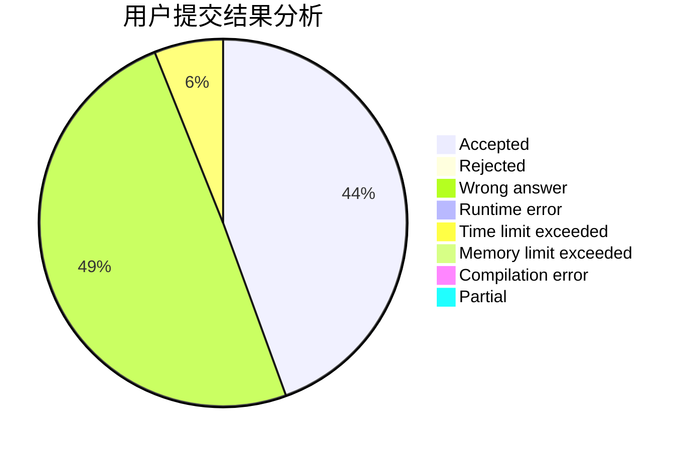
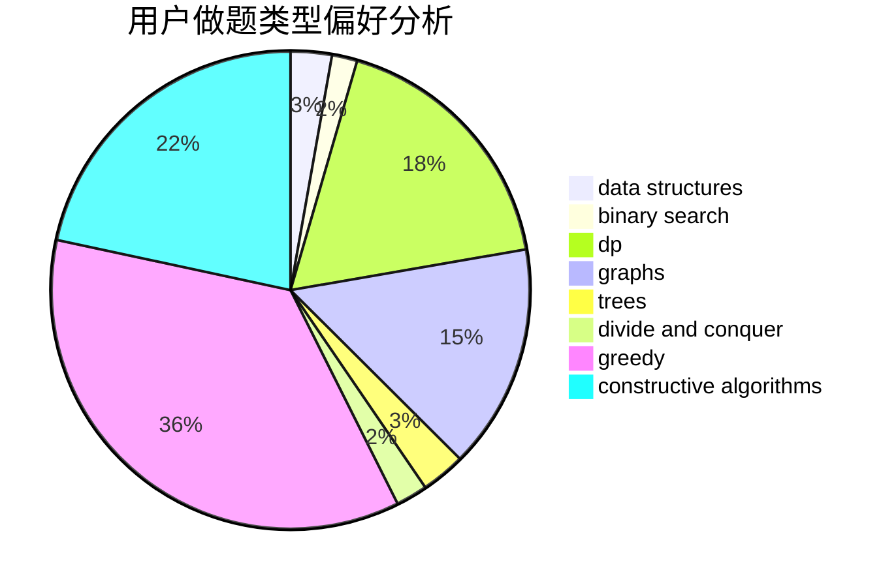

# hnust_zhoubang

<!-- tabs:start -->

#### **用户提交结果分析**

#### **用户做题类型偏好分析**

#### **用户错题知识点分析**

<!-- tabs:end -->
# 推荐题目
[516E](https://codeforces.com/contest/516/problem/E)		math,
                        number theory		  
[135B](https://codeforces.com/contest/135/problem/B)		brute force,
                        geometry,
                        math		  
[633A](https://codeforces.com/contest/633/problem/A)		brute force,
                        math,
                        number theory		  
[733A](https://codeforces.com/contest/733/problem/A)		implementation		  
[612A](https://codeforces.com/contest/612/problem/A)		brute force,
                        implementation,
                        strings		  
[335D](https://codeforces.com/contest/335/problem/D)		brute force,
                        dp		  
[514E](https://codeforces.com/contest/514/problem/E)		dp,
                        matrices		  
[599C](https://codeforces.com/contest/599/problem/C)		sortings		  
[1078A](https://codeforces.com/contest/1078/problem/A)		dsu,graphs,sortings,trees		  
[501C](https://codeforces.com/contest/501/problem/C)		constructive algorithms,
                        data structures,
                        greedy,
                        sortings,
                        trees		  
