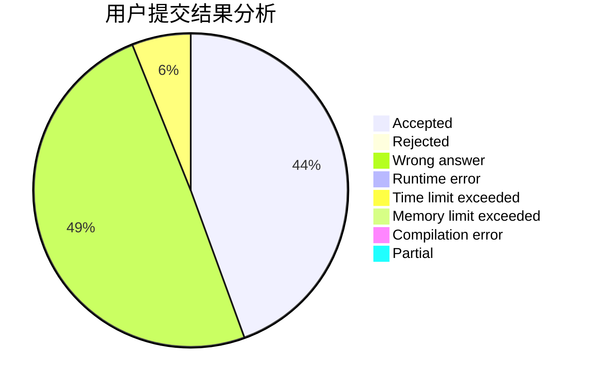
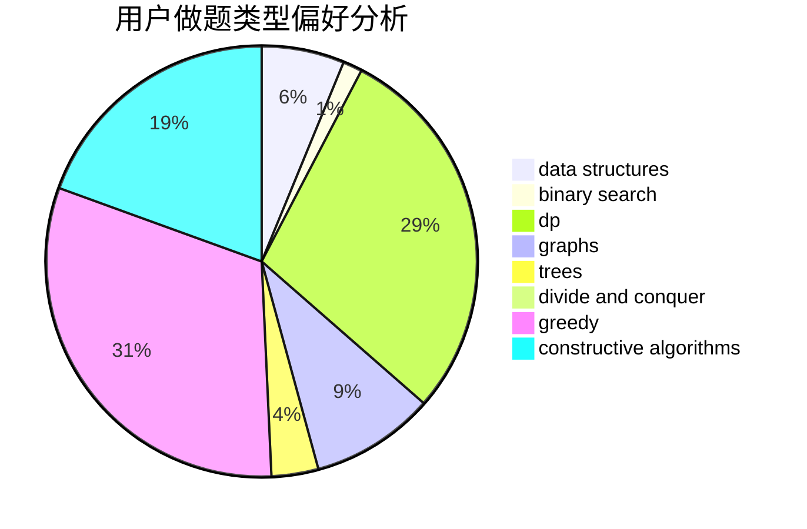

# hnust_zhoubang

<!-- tabs:start -->

#### **用户提交结果分析**

#### **用户做题类型偏好分析**

#### **用户错题知识点分析**

<!-- tabs:end -->
# 推荐题目
[543E](https://codeforces.com/contest/543/problem/E)		constructive algorithms,
                        data structures		  
[13681](https://codeforces.com/contest/1368/problem/1)		dsu,graphs,sortings,trees		  
[665C](https://codeforces.com/contest/665/problem/C)		dp,
                        greedy,
                        strings		  
[750F](https://codeforces.com/contest/750/problem/F)		constructive algorithms,
                        implementation,
                        interactive,
                        trees		  
[631B](https://codeforces.com/contest/631/problem/B)		constructive algorithms,
                        implementation		  
[362C](https://codeforces.com/contest/362/problem/C)		data structures,
                        dp,
                        implementation,
                        math		  
[540C](https://codeforces.com/contest/540/problem/C)		dfs and similar		  
[617B](https://codeforces.com/contest/617/problem/B)		combinatorics		  
[1078D](https://codeforces.com/contest/1078/problem/D)		dsu,graphs,sortings,trees		  
[523A](https://codeforces.com/contest/523/problem/A)		*special problem,
                        implementation		  
