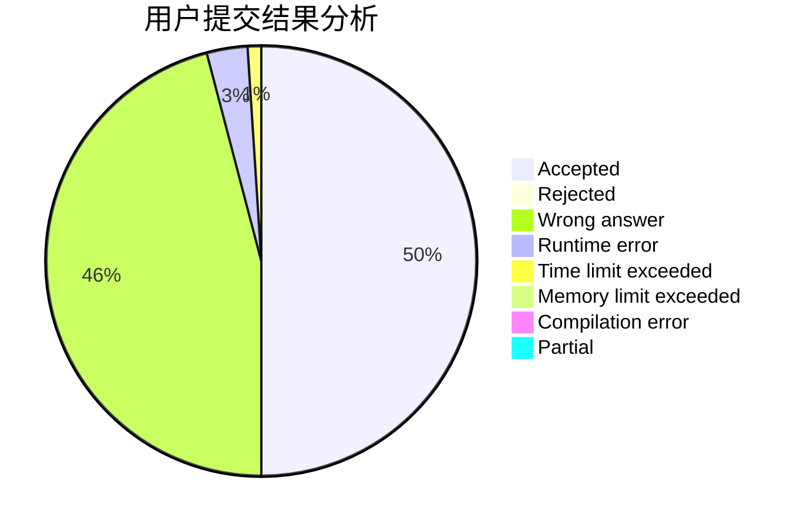
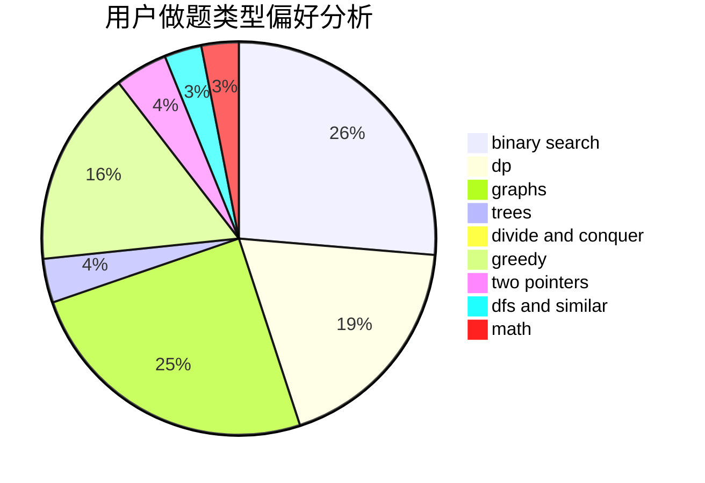

# hnust_zhouzisheng

<!-- tabs:start -->

#### **用户提交结果分析**

#### **用户做题类型偏好分析**

<!-- tabs:end -->
# 推荐题目
[978E](https://codeforces.com/contest/978/problem/E)
[1425B](https://codeforces.com/contest/1425/problem/B)
[788B](https://codeforces.com/contest/788/problem/B)
[1358F](https://codeforces.com/contest/1358/problem/F)
[1091H](https://codeforces.com/contest/1091/problem/H)
[1431D](https://codeforces.com/contest/1431/problem/D)
[581A](https://codeforces.com/contest/581/problem/A)
[1056C](https://codeforces.com/contest/1056/problem/C)
[570A](https://codeforces.com/contest/570/problem/A)
[152B](https://codeforces.com/contest/152/problem/B)
