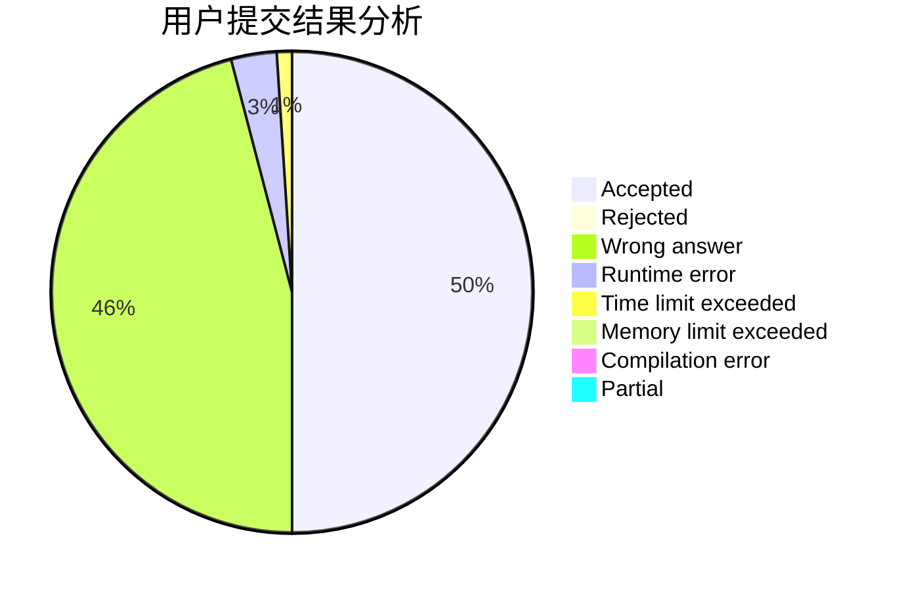
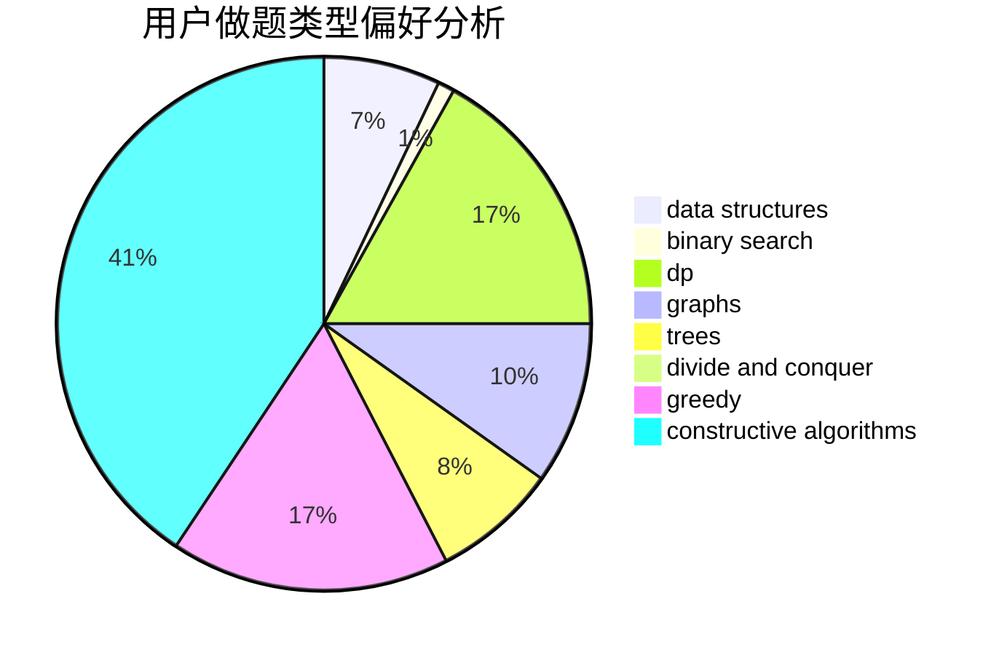

# hnust_zhouzisheng

<!-- tabs:start -->

#### **用户提交结果分析**

#### **用户做题类型偏好分析**

#### **用户错题知识点分析**

<!-- tabs:end -->
# 推荐题目
[978E](https://codeforces.com/contest/978/problem/E)		combinatorics,
                        math		  
[1425B](https://codeforces.com/contest/1425/problem/B)		divide and conquer,
                        dp		  
[788B](https://codeforces.com/contest/788/problem/B)		combinatorics,
                        constructive algorithms,
                        dfs and similar,
                        dsu,
                        graphs		  
[1358F](https://codeforces.com/contest/1358/problem/F)		binary search,
                        constructive algorithms,
                        greedy,
                        implementation		  
[1091H](https://codeforces.com/contest/1091/problem/H)		games		  
[1431D](https://codeforces.com/contest/1431/problem/D)		*special problem,
                        greedy		  
[581A](https://codeforces.com/contest/581/problem/A)		implementation,
                        math		  
[1056C](https://codeforces.com/contest/1056/problem/C)		greedy,
                        implementation,
                        interactive,
                        sortings		  
[570A](https://codeforces.com/contest/570/problem/A)		implementation		  
[152B](https://codeforces.com/contest/152/problem/B)		binary search,
                        implementation		  
