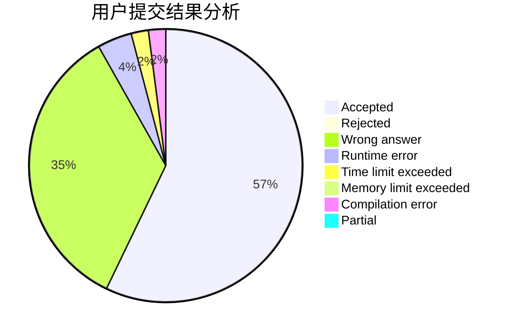
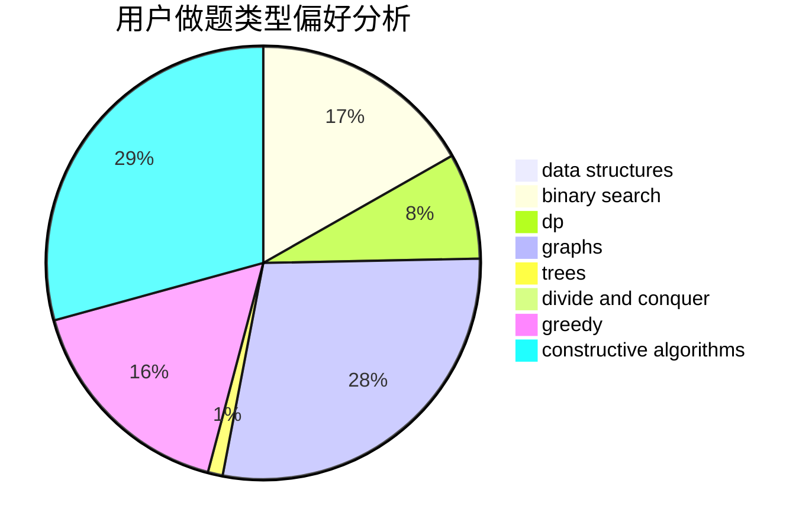
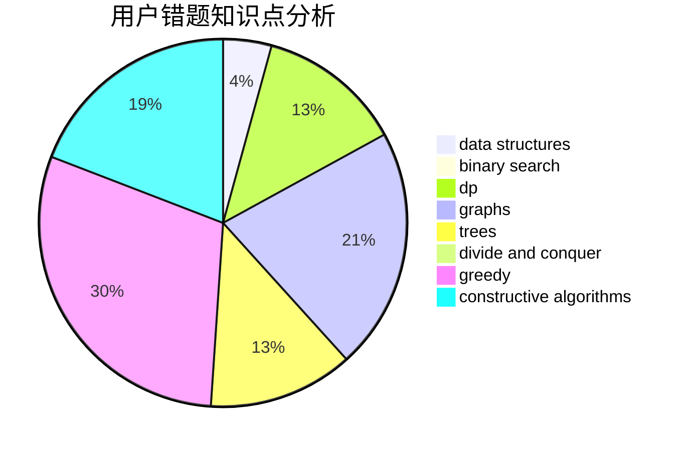

# Bambusoideae

<!-- tabs:start -->

#### **用户提交结果分析**

#### **用户做题类型偏好分析**

#### **用户错题知识点分析**

<!-- tabs:end -->
# 推荐题目
[1462C](https://codeforces.com/contest/1462/problem/C)		brute force,
                        greedy,
                        math		  
[25E](https://codeforces.com/contest/25/problem/E)		hashing,
                        strings		  
[479B](https://codeforces.com/contest/479/problem/B)		brute force,
                        constructive algorithms,
                        greedy,
                        implementation,
                        sortings		  
[1141E](https://codeforces.com/contest/1141/problem/E)		math		  
[39D](https://codeforces.com/contest/39/problem/D)		math		  
[47B](https://codeforces.com/contest/47/problem/B)		implementation		  
[1378A1](https://codeforces.com/contest/1378A/problem/1)		dsu,graphs,sortings,trees		  
[479C](https://codeforces.com/contest/479/problem/C)		greedy,
                        sortings		  
[1083D](https://codeforces.com/contest/1083/problem/D)		data structures,
                        implementation		  
[1428F](https://codeforces.com/contest/1428/problem/F)		binary search,
                        data structures,
                        divide and conquer,
                        dp,
                        two pointers		  
