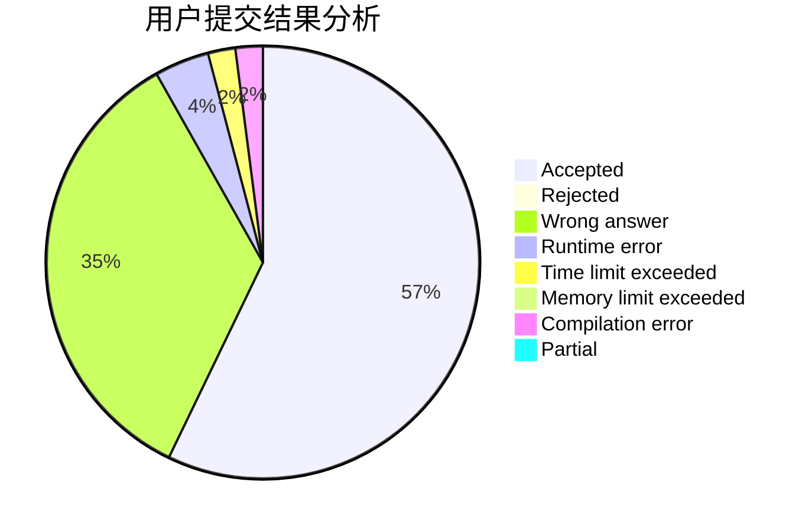
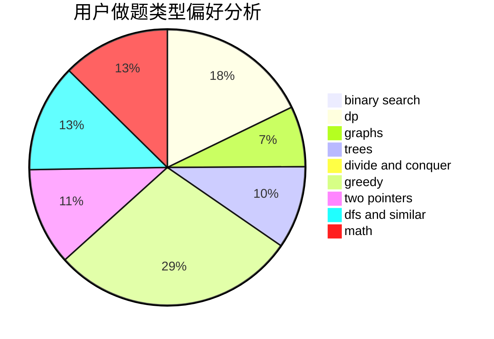

# Bambusoideae

<!-- tabs:start -->

#### **用户提交结果分析**

#### **用户做题类型偏好分析**

<!-- tabs:end -->
# 推荐题目
[1469E](https://codeforces.com/contest/1469/problem/E)
[277E](https://codeforces.com/contest/277/problem/E)
[49A](https://codeforces.com/contest/49/problem/A)
[1143E](https://codeforces.com/contest/1143/problem/E)
[426B](https://codeforces.com/contest/426/problem/B)
[4C](https://codeforces.com/contest/4/problem/C)
[13872](https://codeforces.com/contest/1387/problem/2)
[49E](https://codeforces.com/contest/49/problem/E)
[1084B](https://codeforces.com/contest/1084/problem/B)
[1437F](https://codeforces.com/contest/1437/problem/F)
