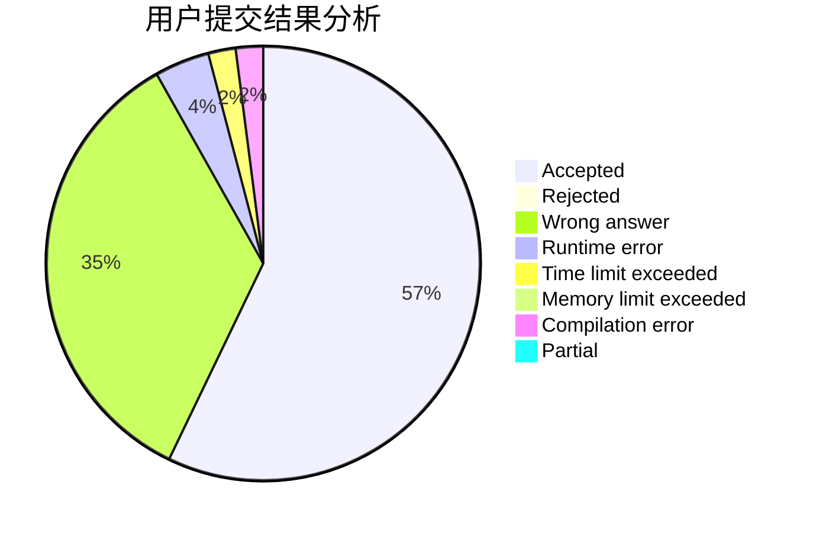
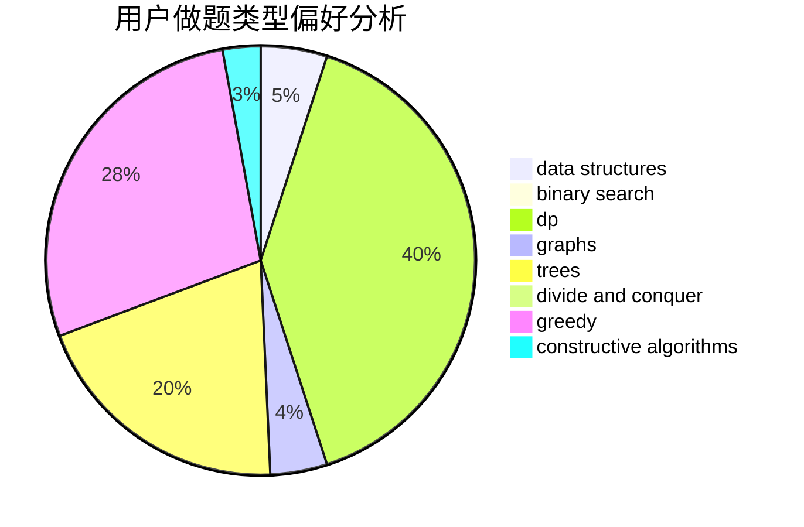

# Bambusoideae

<!-- tabs:start -->

#### **用户提交结果分析**

#### **用户做题类型偏好分析**

#### **用户错题知识点分析**

<!-- tabs:end -->
# 推荐题目
[1469E](https://codeforces.com/contest/1469/problem/E)		bitmasks,
                        brute force,
                        hashing,
                        string suffix structures,
                        strings,
                        two pointers		  
[277E](https://codeforces.com/contest/277/problem/E)		flows,
                        trees		  
[49A](https://codeforces.com/contest/49/problem/A)		implementation		  
[1143E](https://codeforces.com/contest/1143/problem/E)		dsu,graphs,sortings,trees		  
[426B](https://codeforces.com/contest/426/problem/B)		implementation		  
[4C](https://codeforces.com/contest/4/problem/C)		data structures,
                        hashing,
                        implementation		  
[13872](https://codeforces.com/contest/1387/problem/2)		dsu,graphs,sortings,trees		  
[49E](https://codeforces.com/contest/49/problem/E)		dp		  
[1084B](https://codeforces.com/contest/1084/problem/B)		greedy,
                        implementation		  
[1437F](https://codeforces.com/contest/1437/problem/F)		combinatorics,
                        dp,
                        math,
                        two pointers		  
