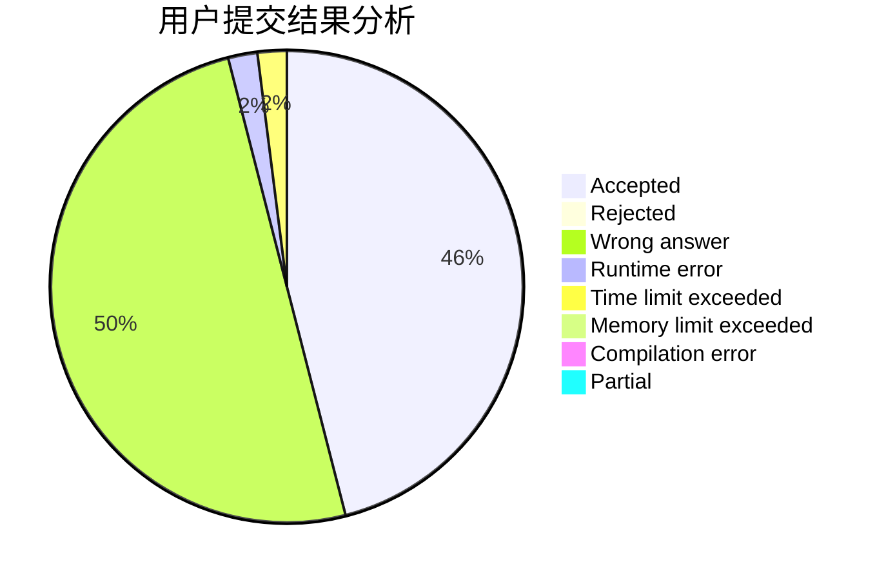
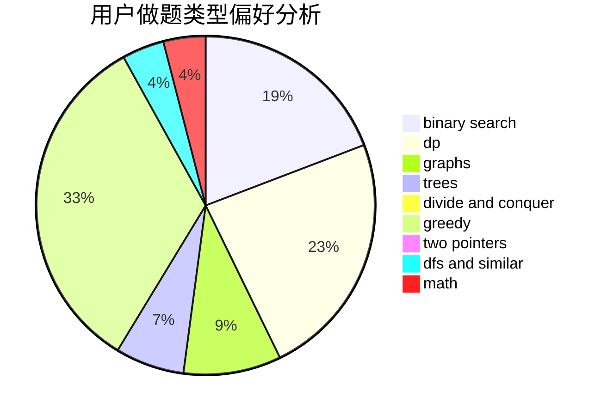

# hongkexin

<!-- tabs:start -->

#### **用户提交结果分析**

#### **用户做题类型偏好分析**

<!-- tabs:end -->
# 推荐题目
[798C](https://codeforces.com/contest/798/problem/C)
[835C](https://codeforces.com/contest/835/problem/C)
[560E](https://codeforces.com/contest/560/problem/E)
[1260F](https://codeforces.com/contest/1260/problem/F)
[1246C](https://codeforces.com/contest/1246/problem/C)
[36B](https://codeforces.com/contest/36/problem/B)
[890B](https://codeforces.com/contest/890/problem/B)
[418B](https://codeforces.com/contest/418/problem/B)
[1140D](https://codeforces.com/contest/1140/problem/D)
[364C](https://codeforces.com/contest/364/problem/C)
