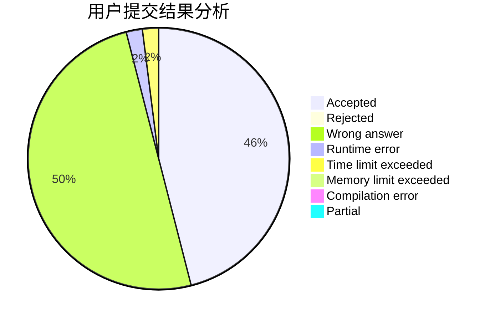
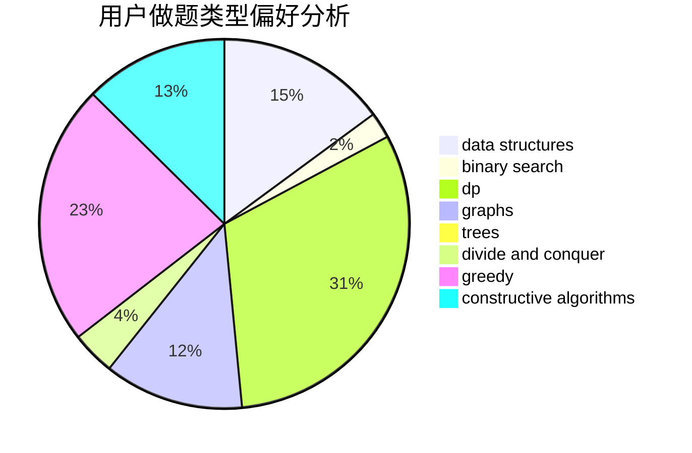
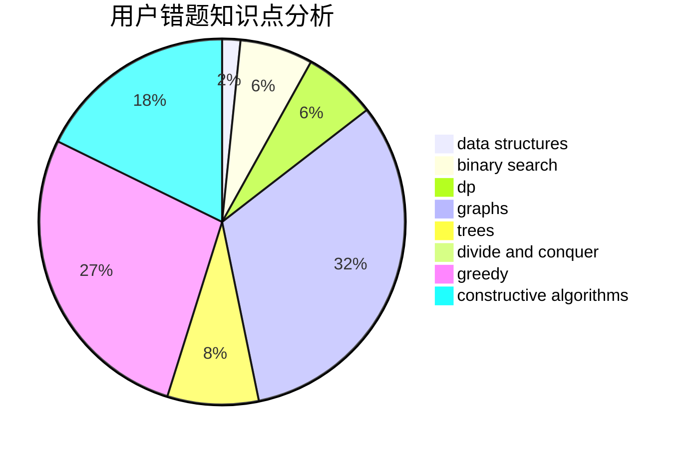

# hongkexin

<!-- tabs:start -->

#### **用户提交结果分析**

#### **用户做题类型偏好分析**

#### **用户错题知识点分析**

<!-- tabs:end -->
# 推荐题目
[77E](https://codeforces.com/contest/77/problem/E)		geometry		  
[816B](https://codeforces.com/contest/816/problem/B)		binary search,
                        data structures,
                        implementation		  
[53E](https://codeforces.com/contest/53/problem/E)		bitmasks,
                        dp		  
[1253D](https://codeforces.com/contest/1253/problem/D)		constructive algorithms,
                        dfs and similar,
                        dsu,
                        graphs,
                        greedy,
                        sortings		  
[1240F](https://codeforces.com/contest/1240/problem/F)		graphs		  
[343A](https://codeforces.com/contest/343/problem/A)		math,
                        number theory		  
[870A](https://codeforces.com/contest/870/problem/A)		brute force,
                        implementation		  
[388E](https://codeforces.com/contest/388/problem/E)		geometry		  
[1138F](https://codeforces.com/contest/1138/problem/F)		dsu,graphs,sortings,trees		  
[338D](https://codeforces.com/contest/338/problem/D)		chinese remainder theorem,
                        math,
                        number theory		  
