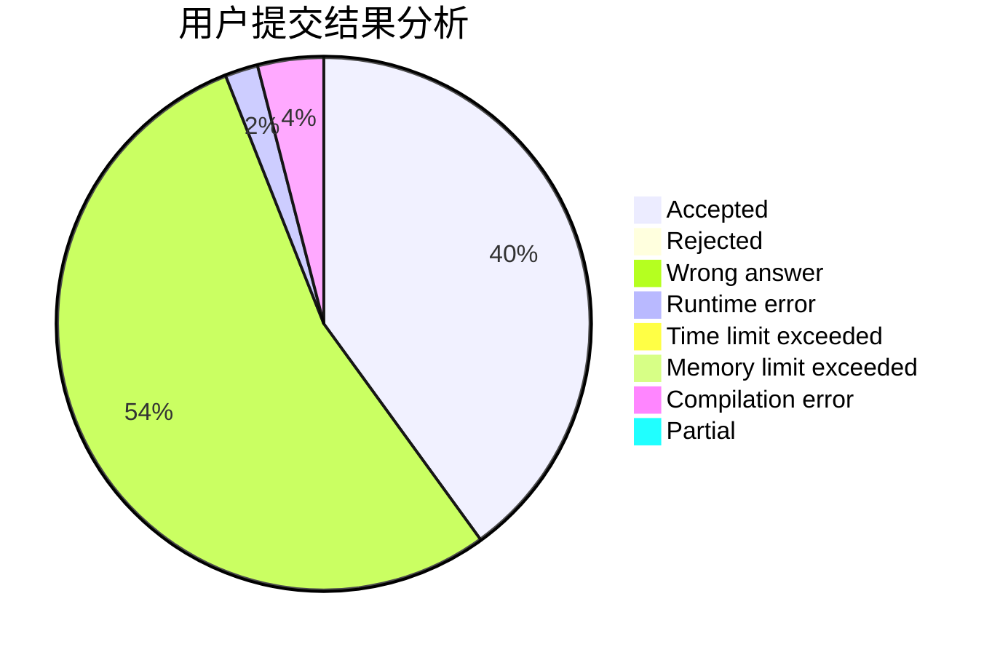
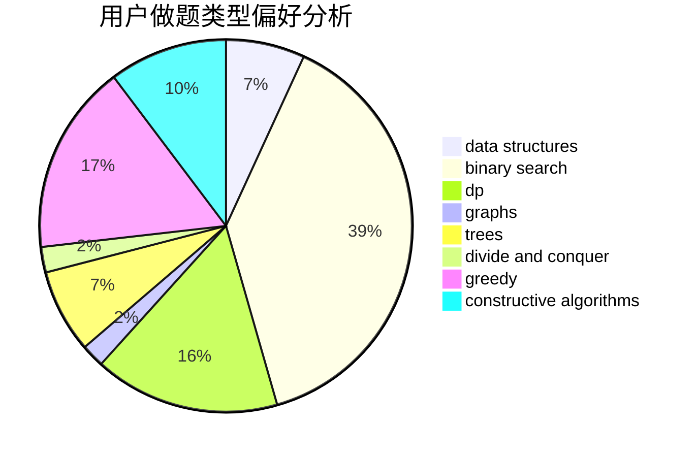

# hou_huangbolin

<!-- tabs:start -->

#### **用户提交结果分析**

#### **用户做题类型偏好分析**

#### **用户错题知识点分析**

<!-- tabs:end -->
# 推荐题目
[629D](https://codeforces.com/contest/629/problem/D)		data structures,
                        dp		  
[1039B](https://codeforces.com/contest/1039/problem/B)		binary search,
                        interactive,
                        probabilities		  
[1290F](https://codeforces.com/contest/1290/problem/F)		dp		  
[1131B](https://codeforces.com/contest/1131/problem/B)		greedy,
                        implementation		  
[1070F](https://codeforces.com/contest/1070/problem/F)		greedy		  
[665F](https://codeforces.com/contest/665/problem/F)		data structures,
                        dp,
                        math,
                        number theory,
                        sortings,
                        two pointers		  
[669D](https://codeforces.com/contest/669/problem/D)		dsu,graphs,sortings,trees		  
[841C](https://codeforces.com/contest/841/problem/C)		dsu,graphs,sortings,trees		  
[741A](https://codeforces.com/contest/741/problem/A)		dfs and similar,
                        math		  
[341C](https://codeforces.com/contest/341/problem/C)		dsu,graphs,sortings,trees		  
