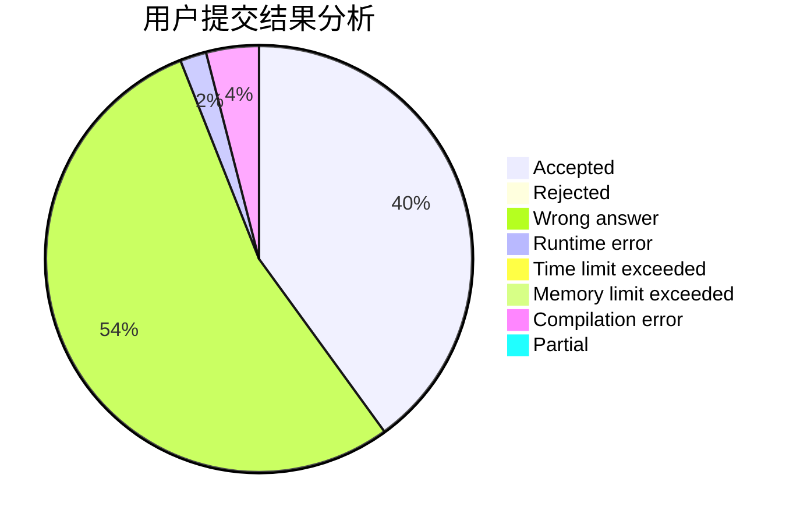
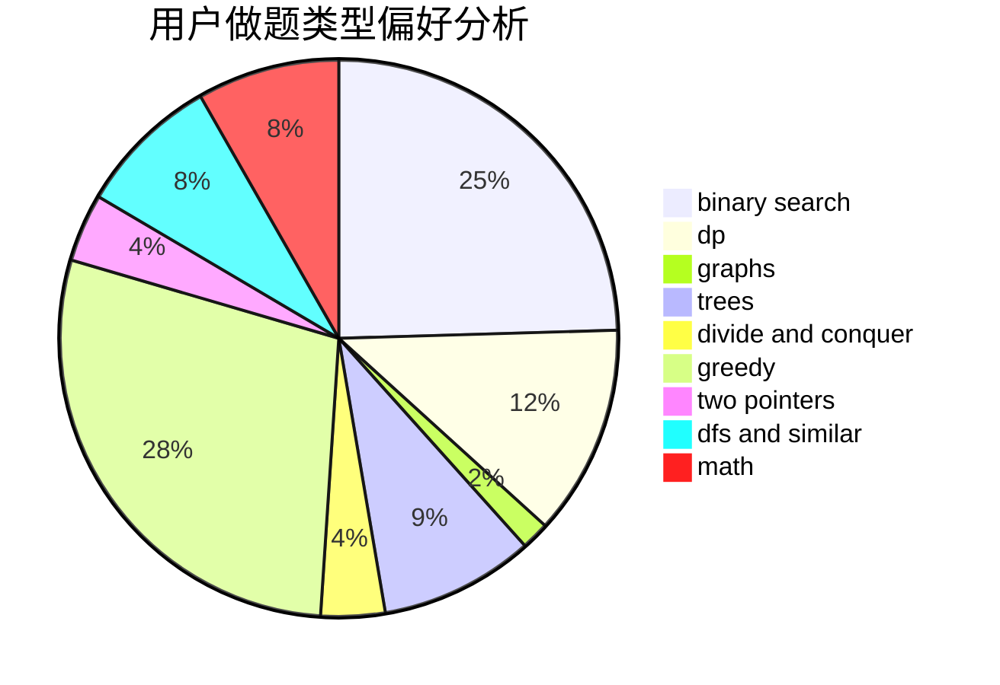

# hou_huangbolin

<!-- tabs:start -->

#### **用户提交结果分析**

#### **用户做题类型偏好分析**

<!-- tabs:end -->
# 推荐题目
[629D](https://codeforces.com/contest/629/problem/D)
[1039B](https://codeforces.com/contest/1039/problem/B)
[1290F](https://codeforces.com/contest/1290/problem/F)
[1131B](https://codeforces.com/contest/1131/problem/B)
[1070F](https://codeforces.com/contest/1070/problem/F)
[665F](https://codeforces.com/contest/665/problem/F)
[669D](https://codeforces.com/contest/669/problem/D)
[841C](https://codeforces.com/contest/841/problem/C)
[741A](https://codeforces.com/contest/741/problem/A)
[341C](https://codeforces.com/contest/341/problem/C)
